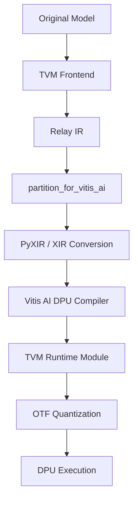

## Overview
Vitis-AI's Model Zoo[^1] provides AI models already optimized considering DPU constraints[^2].

Vitis AI is an integrated platform for quantizing, compiling, and inferencing trained models on Xilinx FPGA platforms.

Vitis AI supports various frameworks such as TensorFlow, PyTorch, and Caffe, and TVM is also included in Vitis-AI's third_party directory[^3]. Therefore, using TVM, we can create a system that converts AI models to hardware-optimized models directly before hardware-optimized AI models are uploaded to Model Zoo.

This document summarizes how to automatically convert original YOLOv4 to DPU-compatible YOLOv4-Leaky using TVM pattern transformation passes, automating the same structure provided by Model Zoo.

## YOLOv4 Conversion Requirements

Two major modifications are needed to run YOLOv4 on DPU. [^4]

### 1. MISH Activation Function → LeakyReLU [^5]

The MISH activation function is defined as:

$$mish(x) = x \cdot \tanh(\ln(1 + \exp(x)))$$

MISH does not support hardware acceleration on DPU, so it must be replaced with LeakyReLU.

$$LeakyReLU(x) = \begin{cases} 
ax & \text{if } x < 0 \\
x & \text{if } x \geq 0
\end{cases}$$

Here, ```a``` is a learnable parameter, typically 0.1 or -0.1.

### 2. MaxPool Kernel Size Limitation

YOLOv4's SPP (Spatial Pyramid Pooling) layer uses large MaxPool kernels (e.g., 9x9), but DPU does not directly support this. According to DPU constraints, MaxPool kernel size must be limited to 8x8 or less[^2].

When large kernels must be used, they can be decomposed into multiple small kernels while maintaining the same receptive field. For example, 9x9 MaxPool can be decomposed into two 5x5 MaxPools.

## TVM Pattern Matching Implementation for MISH and MaxPool Conversion

### 1. MISH Pattern Definition and Conversion

Define the MISH activation function pattern (`exp → add → log → tanh → multiply`) and convert it to LeakyReLU.

```python
from tvm.relax.dpl import pattern  

def create_mish_pattern():
    """MISH activation function pattern: x * tanh(log(exp(x) + 1))"""
    input_pat = pattern.wildcard()
    
    # exp(x)
    exp_pat = pattern.is_op("relax.exp")(input_pat)
    
    # exp(x) + 1
    add_pat = pattern.is_op("relax.add")(exp_pat, pattern.is_const(1.0))
    
    # log(exp(x) + 1)
    log_pat = pattern.is_op("relax.log")(add_pat)
    
    # tanh(log(exp(x) + 1))
    tanh_pat = pattern.is_op("relax.tanh")(log_pat)
    
    # x * tanh(log(exp(x) + 1))
    mish_pat = pattern.is_op("relax.multiply")(input_pat, tanh_pat)
    
    return mish_pat, {"input": input_pat}

def create_mish_rewriter():
    """Rewriter that converts MISH to LeakyReLU(alpha=0.1)"""
    def rewriter(expr, matches):
        input_expr = matches["input"]
        # Convert to LeakyReLU(alpha=0.1)
        return relax.op.nn.leaky_relu(input_expr, alpha=0.1)
    return rewriter
```

This pattern detects the specific structure of the MISH activation function in the computation graph. It finds operations connected in the order `exp → add → log → tanh → multiply` and replaces them with a single `leaky_relu` operation.

### 2. MaxPool Decomposition Pattern

Define a pattern that decomposes 9x9 MaxPool into two 5x5 MaxPools.

```python
def create_large_maxpool_pattern():
    """9x9 MaxPool pattern definition"""
    input_pat = pattern.wildcard()
    
    # 9x9 MaxPool with padding=[4,4,4,4]
    maxpool_pat = pattern.is_op("relax.nn.max_pool2d")(input_pat).has_attr({
        "pool_size": [9, 9],
        "padding": [4, 4, 4, 4]
    })
    
    return maxpool_pat, {"input": input_pat}

def create_maxpool_decomposer():
    """Decompose 9x9 MaxPool into two 5x5 MaxPools"""
    def rewriter(expr, matches):
        input_expr = matches["input"]
        
        # First 5x5 MaxPool
        first_pool = relax.op.nn.max_pool2d(
            input_expr, 
            pool_size=[5, 5], 
            padding=[2, 2, 2, 2]
        )
        
        # Second 5x5 MaxPool
        second_pool = relax.op.nn.max_pool2d(
            first_pool,
            pool_size=[5, 5],
            padding=[2, 2, 2, 2]
        )
        
        return second_pool
    return rewriter
```

This pattern detects MaxPool operations with `pool_size=[9, 9]` and `padding=[4, 4, 4, 4]` and decomposes them into two 5x5 MaxPools while maintaining the same receptive field.

### 3. Applying PatternMatchingRewriter

Apply the defined patterns and rewriters to perform actual conversion.

```python
from tvm.relax.dpl import PatternMatchingRewriter

def apply_transformations(mod):
    """Apply MISH and MaxPool transformations to module"""
    
    # MISH conversion
    mish_pattern, mish_annotations = create_mish_pattern()
    mish_rewriter = create_mish_rewriter()
    mish_rewriter_obj = PatternMatchingRewriter.from_pattern(
        mish_pattern, mish_rewriter
    )
    
    # MaxPool decomposition
    maxpool_pattern, maxpool_annotations = create_large_maxpool_pattern()
    maxpool_rewriter = create_maxpool_decomposer()
    maxpool_rewriter_obj = PatternMatchingRewriter.from_pattern(
        maxpool_pattern, maxpool_rewriter
    )
    
    # Apply transformations sequentially
    transformed_mod = mish_rewriter_obj(mod)
    transformed_mod = maxpool_rewriter_obj(transformed_mod)
    
    return transformed_mod
```

Transformations are applied sequentially. First, MISH patterns are converted to LeakyReLU, then large MaxPools are decomposed.

## IR Before/After Conversion

### Before Conversion

```python
def @main(%data: Tensor[(1, 3, 32, 32), float32], %weight1: Tensor[(16, 3, 3, 3), float32]) {
  %0 = nn.conv2d(%data, %weight1, padding=[1, 1, 1, 1], kernel_size=[3, 3]);
  %1 = exp(%0);
  %2 = add(%1, 1f);
  %3 = log(%2);
  %4 = tanh(%3);
  %5 = multiply(%0, %4);
  nn.max_pool2d(%5, pool_size=[9, 9], padding=[4, 4, 4, 4])
}
```

### After Conversion

```python
def @main(%data: Tensor[(1, 3, 32, 32), float32], %weight1: Tensor[(16, 3, 3, 3), float32]) {
  %0 = nn.conv2d(%data, %weight1, padding=[1, 1, 1, 1], kernel_size=[3, 3]);
  %1 = nn.leaky_relu(%0, alpha=0.1f);
  %2 = nn.max_pool2d(%1, pool_size=[5, 5], padding=[2, 2, 2, 2]);
  nn.max_pool2d(%2, pool_size=[5, 5], padding=[2, 2, 2, 2])
}
```

The flow after Relay IR is as follows.



[^1]: **Vitis-AI Model Zoo**: https://github.com/Xilinx/Vitis-AI/tree/master/model_zoo
[^2]: **Vitis AI Supported Operators**: https://docs.amd.com/r/en-US/ug1414-vitis-ai/Currently-Supported-Operators
[^3]: **Vitis-AI/third_party/tvm**: https://github.com/Xilinx/Vitis-AI/tree/master/third_party/tvm
[^4]: Andrew Ekblad, Trupti  Mahendrakar,Ryan White, Markus  Wilde, Isaac Silver, and  Brooke Wheeler, "Resource-constrained FPGA Design for Satellite Component Feature Extraction",  in  IEEE Aerospace Conference, BigSky, MT, USA, 2023
[^5]: A. L. Mass, A. Y. Hannun and A. Y. Ng, "Rectifier Nonlinearities Improve Neural Network Acoustic Models", in International Conference on Machine Learning, Atlanta, 2013

**Language**: [한국어 (Korean)](/posts/2025/12/tvm-yolov4-vitis-ai-dpu-transform/)

