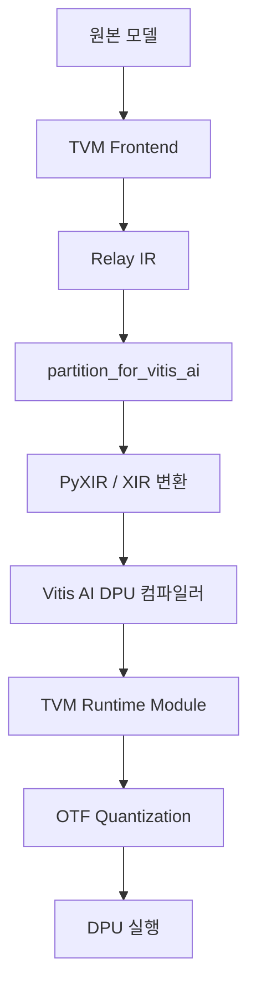

## 개요
Vitis-AI의 Model Zoo[^1] 는 DPU 제약[^2] 을 고려해 이미 최적화된 AI 모델을 제공합니다. 

Vitis AI는 Xilinx의 FPGA 플랫폼에서 훈련된 모델을 양자화(Quantization), 컴파일(Compilation), 추론(Inference)하기 위한 통합 플랫폼입니다. 

Vitis AI는 TensorFlow, PyTorch, Caffe 등 다양한 프레임워크를 지원하며, TVM도 Vitis-AI의 third_party 디렉토리에 포함되어 있습니다[^3]. 따라서 TVM을 활용하여, Model Zoo에 하드웨어에 최적화된 AI 모델이 올라오기 전에, 직접 하드웨어에 최적화된 AI 모델로 변환할 수 있는 시스템을 조성할 수 있습니다.  

본 문서는 TVM의 패턴 변환 패스(Transform Pass)를 활용해 원본 YOLOv4를 DPU 호환 YOLOv4-Leaky로 자동 변환하여, Model Zoo에서 제공하는 결과와 동등한 구조를 자동화하는 방법을 정리합니다.

## YOLOv4 변환 필요 사항

YOLOv4를 DPU에서 실행하기 위해서는 두 가지 주요 수정이 필요합니다. [^4]

### 1. MISH 활성화 함수 → LeakyReLU [^5]

MISH 활성화 함수는 다음과 같이 정의됩니다:

$$mish(x) = x \cdot \tanh(\ln(1 + \exp(x)))$$

MISH는 DPU에서 하드웨어 가속을 지원하지 않으므로, LeakyReLU로 대체해야 합니다.

$$LeakyReLU(x) = \begin{cases} 
ax & \text{if } x < 0 \\
x & \text{if } x \geq 0
\end{cases}$$

여기서 ```a```는 학습 가능한 파라미터이며, 일반적으로 0.1 또는 -0.1을 사용합니다.

### 2. MaxPool 커널 크기 제한

YOLOv4의 SPP(Spatial Pyramid Pooling) 레이어에서 큰 MaxPool 커널(예: 9x9)을 사용하는데, DPU는 이를 직접 지원하지 않습니다. DPU 제약에 따르면, MaxPool 커널 크기를 8x8 이하로 제한해야 합니다[^2].

큰 커널을 사용해야 하는 경우, 동일한 receptive field를 유지하면서 여러 개의 작은 커널로 분해할 수 있습니다. 예를 들어, 9x9 MaxPool은 5x5 MaxPool 2회로 분해할 수 있습니다.

## TVM Pattern Matching으로 MISH 및 MaxPool 변환 구현

### 1. MISH 패턴 정의 및 변환

MISH 활성화 함수 패턴(`exp → add → log → tanh → multiply`)을 정의하고 LeakyReLU로 변환합니다.

```python
from tvm.relax.dpl import pattern  

def create_mish_pattern():
    """MISH 활성화 함수 패턴: x * tanh(log(exp(x) + 1))"""
    input_pat = pattern.wildcard()
    
    # exp(x)
    exp_pat = pattern.is_op("relax.exp")(input_pat)
    
    # exp(x) + 1
    add_pat = pattern.is_op("relax.add")(exp_pat, pattern.is_const(1.0))
    
    # log(exp(x) + 1)
    log_pat = pattern.is_op("relax.log")(add_pat)
    
    # tanh(log(exp(x) + 1))
    tanh_pat = pattern.is_op("relax.tanh")(log_pat)
    
    # x * tanh(log(exp(x) + 1))
    mish_pat = pattern.is_op("relax.multiply")(input_pat, tanh_pat)
    
    return mish_pat, {"input": input_pat}

def create_mish_rewriter():
    """MISH를 LeakyReLU(alpha=0.1)로 변환하는 rewriter"""
    def rewriter(expr, matches):
        input_expr = matches["input"]
        # LeakyReLU(alpha=0.1)로 변환
        return relax.op.nn.leaky_relu(input_expr, alpha=0.1)
    return rewriter
```

이 패턴은 연산 그래프에서 MISH 활성화 함수의 특정 구조를 감지합니다. `exp → add → log → tanh → multiply` 순서로 연결된 연산을 찾아서 단일 `leaky_relu` 연산으로 대체합니다.

### 2. MaxPool 분해 패턴

9x9 MaxPool을 5x5 MaxPool 두 개로 분해하는 패턴을 정의합니다.

```python
def create_large_maxpool_pattern():
    """9x9 MaxPool 패턴 정의"""
    input_pat = pattern.wildcard()
    
    # 9x9 MaxPool with padding=[4,4,4,4]
    maxpool_pat = pattern.is_op("relax.nn.max_pool2d")(input_pat).has_attr({
        "pool_size": [9, 9],
        "padding": [4, 4, 4, 4]
    })
    
    return maxpool_pat, {"input": input_pat}

def create_maxpool_decomposer():
    """9x9 MaxPool을 5x5 MaxPool 두 개로 분해"""
    def rewriter(expr, matches):
        input_expr = matches["input"]
        
        # 첫 번째 5x5 MaxPool
        first_pool = relax.op.nn.max_pool2d(
            input_expr, 
            pool_size=[5, 5], 
            padding=[2, 2, 2, 2]
        )
        
        # 두 번째 5x5 MaxPool
        second_pool = relax.op.nn.max_pool2d(
            first_pool,
            pool_size=[5, 5],
            padding=[2, 2, 2, 2]
        )
        
        return second_pool
    return rewriter
```

이 패턴은 `pool_size=[9, 9]`와 `padding=[4, 4, 4, 4]`를 가진 MaxPool 연산을 감지하고, 동일한 receptive field를 유지하면서 두 개의 5x5 MaxPool로 분해합니다.

### 3. PatternMatchingRewriter 적용

정의된 패턴과 rewriter를 사용하여 실제 변환을 수행합니다.

```python
from tvm.relax.dpl import PatternMatchingRewriter

def apply_transformations(mod):
    """모듈에 MISH 및 MaxPool 변환 적용"""
    
    # MISH 변환
    mish_pattern, mish_annotations = create_mish_pattern()
    mish_rewriter = create_mish_rewriter()
    mish_rewriter_obj = PatternMatchingRewriter.from_pattern(
        mish_pattern, mish_rewriter
    )
    
    # MaxPool 분해
    maxpool_pattern, maxpool_annotations = create_large_maxpool_pattern()
    maxpool_rewriter = create_maxpool_decomposer()
    maxpool_rewriter_obj = PatternMatchingRewriter.from_pattern(
        maxpool_pattern, maxpool_rewriter
    )
    
    # 변환 순차적 적용
    transformed_mod = mish_rewriter_obj(mod)
    transformed_mod = maxpool_rewriter_obj(transformed_mod)
    
    return transformed_mod
```

변환은 순차적으로 적용됩니다. 먼저 MISH 패턴을 LeakyReLU로 변환한 후, 큰 MaxPool을 분해합니다.

## 변환 전/후 IR

### 변환 전

```python
def @main(%data: Tensor[(1, 3, 32, 32), float32], %weight1: Tensor[(16, 3, 3, 3), float32]) {
  %0 = nn.conv2d(%data, %weight1, padding=[1, 1, 1, 1], kernel_size=[3, 3]);
  %1 = exp(%0);
  %2 = add(%1, 1f);
  %3 = log(%2);
  %4 = tanh(%3);
  %5 = multiply(%0, %4);
  nn.max_pool2d(%5, pool_size=[9, 9], padding=[4, 4, 4, 4])
}
```

### 변환 후

```python
def @main(%data: Tensor[(1, 3, 32, 32), float32], %weight1: Tensor[(16, 3, 3, 3), float32]) {
  %0 = nn.conv2d(%data, %weight1, padding=[1, 1, 1, 1], kernel_size=[3, 3]);
  %1 = nn.leaky_relu(%0, alpha=0.1f);
  %2 = nn.max_pool2d(%1, pool_size=[5, 5], padding=[2, 2, 2, 2]);
  nn.max_pool2d(%2, pool_size=[5, 5], padding=[2, 2, 2, 2])
}
```
Relay IR 이후의 flow는 다음과 같습니다.



[^1]: **Vitis-AI Model Zoo**: https://github.com/Xilinx/Vitis-AI/tree/master/model_zoo
[^2]: **Vitis AI 지원 연산자**: https://docs.amd.com/r/en-US/ug1414-vitis-ai/Currently-Supported-Operators
[^3]: **Vitis-AI/third_party/tvm**: https://github.com/Xilinx/Vitis-AI/tree/master/third_party/tvm
[^4]: Andrew Ekblad, Trupti  Mahendrakar,Ryan White, Markus  Wilde, Isaac Silver, and  Brooke Wheeler, "Resource-constrained FPGA Design for Satellite Component Feature Extraction",  in  IEEE Aerospace Conference, BigSky, MT, USA, 2023
[^5]: A. L. Mass, A. Y. Hannun and A. Y. Ng, "Rectifier Nonlinearities Improve Neural Network Acoustic Models", in International Conference on Machine Learning, Atlanta, 2013

**Language**: [English](/posts/2025/12/tvm-yolov4-vitis-ai-dpu-transform-en/)