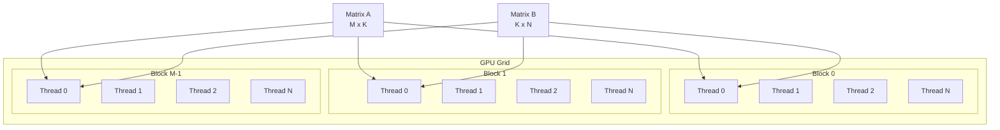

Basic GPU Implementation: 95 GFLOPS

## Results

| Matrix Size | NumPy (CPU) | Step 1 (GPU) | Speedup |
|----------|------------|-------------|----------|
| 256x256 | 5 GFLOPS | 91 GFLOPS | 18x |
| 512x512 | 20 GFLOPS | 91 GFLOPS | 4.6x |
| 1024x1024 | 15 GFLOPS | 95 GFLOPS | 6.3x |

Average: 95 GFLOPS

## 1. Compiler Theory: Data Parallelism

### Iteration Space of Matrix Multiplication

#### Matrix Multiplication Code
Matrix multiplication can be performed by executing the following triple loop:

```cpp
#include <iostream>
#include <vector>

// Function that multiplies M x K matrix and K x N matrix to produce M x N matrix
void matrix_multiply(const std::vector<std::vector<float>>& A,
                     const std::vector<std::vector<float>>& B,
                     std::vector<std::vector<float>>& C,
                     int M, int N, int K) {

    // Triple loop: core of matrix multiplication
    for (int i = 0; i < M; ++i) {      // Iterate over rows of output matrix C
        for (int j = 0; j < N; ++j) {  // Iterate over columns of output matrix C
            float sum = 0.0f;
            for (int k = 0; k < K; ++k) { // Iterate for dot product calculation
                // Core operation
                sum += A[i][k] * B[k][j];
            }
            C[i][j] = sum;
        }
    }
}
```

**Iteration Space of Matrix Multiplication**:

The compiler interprets this triple loop as a mathematical space.

- Loop variables `i`, `j`, `k` become coordinates.
- `for(int i=0; i<M; ++i)`: i-axis (range: 0 ~ M - 1)
- `for(int j=0; j<N; ++j)`: j-axis (range: 0 ~ N - 1)
- `for(int k=0; k<K; ++k)`: k-axis (range: 0 ~ K - 1)
- Total M × N × K iterations

This is called the iteration space.

**Dependency Analysis**:

Before performing tasks in parallel, we must check whether tasks depend on each other. That is, we check for Data Dependency.

In matrix multiplication, we need to check whether the calculation of `C[i][j]` depends on the calculation of another `C[i'][j']`.

When writing a value to the memory location `C[i][j]`, it only occurs when the outer loop variables are `i` and `j`.

The data read when calculating `C[i][j]` is `A[i][...]`, `B[...][j]`, which are values already stored initially. Values that are not newly written can be read simultaneously without issues.

In other words, in matrix multiplication, each operation is independent of each other, so they can be performed in parallel.

### Data Parallelism on GPU

**A500 GPU Structure**:
- 16 SM (Streaming Multiprocessor)
- 1024 FP32 CUDA Cores
- Each SM can execute up to 1536 threads simultaneously

**Basic Parallelization Strategy**:
1. M × N independent calculations
2. Assign each calculation to one thread
3. 1024 cores process simultaneously

## 2. TVM TensorIR Implementation

### TensorIR Definition

```python
@tvm.script.ir_module
class MatmulModule:
    @T.prim_func
    def matmul(
        A: T.Buffer((M, K), "float32"),
        B: T.Buffer((K, N), "float32"),
        C: T.Buffer((M, N), "float32")
    ):
        # Triple loop = 3D Iteration Space
        for i, j, k in T.grid(M, N, K):
            with T.block("C"):
                vi, vj, vk = T.axis.remap("SSR", [i, j, k])
                # S: Spatial (can be parallelized)
                # R: Reduction (sequential required)
                
                with T.init():
                    C[vi, vj] = 0.0
                C[vi, vj] = C[vi, vj] + A[vi, vk] * B[vk, vj]
```

- `for i, j, k in T.grid(M, N, K)`: Defines the work space.
- `vi, vj, vk = T.axis.remap("SSR", [i, j, k])`:
    - Specifies that `i` and `j` axes are independent, so they can be processed in parallel.
    - Specifies that `k` axis must be processed sequentially because values must be accumulated through `+=` operation.

### 2D Thread Mapping

```python
# i → block, j → thread
sch.bind(i, "blockIdx.x")    # M blocks
sch.bind(j, "threadIdx.x")   # N threads
```

- Maps each iteration of the `i` loop to GPU's Thread Block ID (`blockIdx.x`) one by one, and each iteration of the `j` loop to GPU's Block-internal Thread ID (`threadIdx.x`) one by one.
- That is, the `for i...`, `for j...` loops disappear, and M blocks and N threads within each block execute simultaneously.

#### Thread Mapping Visualization



Each thread is responsible for one output element `C[i,j]`, and all threads perform calculations simultaneously and independently.

## 3. Generated CUDA Pattern

```python
# Block i (one of M blocks)
for i in blockIdx.x:
  # Thread j (N threads)
  for j in threadIdx.x:
    # Each thread calculates one C[i,j]
    C[i,j] = 0
    for k in range(K):
      C[i,j] += A[i,k] * B[k,j]
```

## 4. Results

### Performance: 95 GFLOPS

3.1% of A500 Peak (3.072 TFLOPS)
- Very low efficiency

## Execution

```bash
python test_individual/test_step1.py
```

Code can be found at [https://github.com/kimm240/matrix-multiplication-optimization-with-tvm](https://github.com/kimm240/matrix-multiplication-optimization-with-tvm).

---

**Series Posts**

- Next: [Step 2: Tiling + Loop Reordering](/posts/2025/12/tvm-matmul-optimization-step2-en/)

**Language**: [한국어 (Korean)](/posts/2025/12/tvm-matmul-optimization-step1/)

