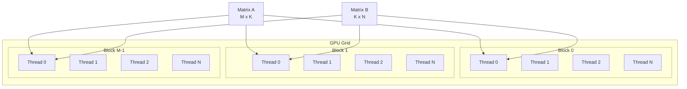

기본 GPU 구현: 95 GFLOPS

## 성과

| 행렬 크기 | NumPy (CPU) | Step 1 (GPU) | 향상 배수 |
|----------|------------|-------------|----------|
| 256x256 | 5 GFLOPS | 91 GFLOPS | 18배 |
| 512x512 | 20 GFLOPS | 91 GFLOPS | 4.6배 |
| 1024x1024 | 15 GFLOPS | 95 GFLOPS | 6.3배 |

평균: 95 GFLOPS

## 1. 컴파일러 이론: Data Parallelism

### 행렬 곱셈의 Iteration Space

#### 행렬 곱셈 코드
행렬 곱셈은, 다음 3중 루프를 실행하여 수행할 수 있습니다.

```cpp
#include <iostream>
#include <vector>

// M x K 행렬과 K x N 행렬을 곱하여 M x N 행렬을 생성하는 함수
void matrix_multiply(const std::vector<std::vector<float>>& A,
                     const std::vector<std::vector<float>>& B,
                     std::vector<std::vector<float>>& C,
                     int M, int N, int K) {

    // 3중 루프: 행렬 곱셈의 핵심
    for (int i = 0; i < M; ++i) {      // 출력 행렬 C의 행을 순회
        for (int j = 0; j < N; ++j) {  // 출력 행렬 C의 열을 순회
            float sum = 0.0f;
            for (int k = 0; k < K; ++k) { // 내적 계산을 위한 순회
                // 핵심 연산
                sum += A[i][k] * B[k][j];
            }
            C[i][j] = sum;
        }
    }
}
```

**Matrix Multiplication의 Iteration Space**:

컴파일러는, 이 3중 루프를 수학적 공간으로 해석합니다.

- 루프 변수 `i`, `j`, `k`는 좌표가 됩니다.
- `for(int i=0; i<M; ++i)`: i축(범위: 0 ~ M - 1)
- `for(int j=0; j<N; ++j)`: j축(범위: 0 ~ N - 1)
- `for(int k=0; k<K; ++k)`: k축(범위: 0 ~ K - 1)
- 총 M × N × K개의 반복

이를 반복 공간(Iteration Space)라고 부릅니다.

**Dependency Analysis**:

작업들을 병렬로 수행하기 전에, 작업들이 서로 의존하는지 확인해야 합니다. 즉 Data Dependency가 있는지 검사합니다.

행렬 곱셈에서는, `C[i][j]`의 계산 과정이 다른 `C[i'][j']`의 계산 과정에 의존하는지 확인해야 합니다.

`C[i][j]`라는 메모리 위치에 값을 쓸 때, 바깥쪽 루프 변수가 `i`, `j`일 때만 발생합니다.

`C[i][j]`를 계산할 때 읽는 데이터는 `A[i][...]`, `B[...][j]`인데, 이들은 초기에 이미 저장되어 있는 값입니다. 새로 Write되지 않는 값은 동시에 Read해도 무관합니다.

즉, 행렬 곱셈에서, 각 연산은 서로에게 독립적이므로, 병렬로 수행할 수 있습니다.

### GPU의 Data Parallelism

**A500 GPU 구조**:
- 16 SM (Streaming Multiprocessor)
- 1024 FP32 CUDA Cores
- 각 SM은 최대 1536개 스레드 동시 실행

**기본 병렬화 전략**:
1. M × N개의 독립적인 계산
2. 각 계산을 하나의 스레드에 할당
3. 1024개 코어가 동시에 처리

## 2. TVM TensorIR 구현

### TensorIR 정의

```python
@tvm.script.ir_module
class MatmulModule:
    @T.prim_func
    def matmul(
        A: T.Buffer((M, K), "float32"),
        B: T.Buffer((K, N), "float32"),
        C: T.Buffer((M, N), "float32")
    ):
        # 3중 루프 = 3차원 Iteration Space
        for i, j, k in T.grid(M, N, K):
            with T.block("C"):
                vi, vj, vk = T.axis.remap("SSR", [i, j, k])
                # S: Spatial (병렬 가능)
                # R: Reduction (순차 필요)
                
                with T.init():
                    C[vi, vj] = 0.0
                C[vi, vj] = C[vi, vj] + A[vi, vk] * B[vk, vj]
```

- `for i, j, k in T.grid(M, N, K)`: 작업 공간을 정의합니다.
- `vi, vj, vk = T.axis.remap("SSR", [i, j, k])`:
    - `i`축, `j`축은 서로 독립적이므로, 병렬 처리를 할 수 있음을 명시합니다.
    - `k`축은 `+=` 연산을 통해 값을 누적해야 하므로, 순차 처리를 해야 함을 명시합니다.

### 2D 스레드 매핑

```python
# i → 블록, j → 스레드
sch.bind(i, "blockIdx.x")    # M개 블록
sch.bind(j, "threadIdx.x")   # N개 스레드
```

- `i`루프의 각 반복을 GPU의 Thread Block ID(`blockIdx.x`)에 하나씩, `j`루프의 각 반복을 GPU의 Block 내 Thread ID(`threadIdx.x`)에 하나씩 Mapping합니다.
- 즉 `for i...`, `for j...`루프가 사라지고, M개의 블록, 블록 내부에서 N개의 스레드가 동시에 실행됩니다.

#### 스레드 매핑 시각화



각 스레드는 하나의 출력 원소 `C[i,j]`를 담당하며, 모든 스레드가 동시에 독립적으로 계산을 수행합니다.

## 3. 생성된 CUDA 패턴

```python
# 블록 i (M개 블록 중 하나)
for i in blockIdx.x:
  # 스레드 j (N개 스레드)
  for j in threadIdx.x:
    # 각 스레드가 하나의 C[i,j] 계산
    C[i,j] = 0
    for k in range(K):
      C[i,j] += A[i,k] * B[k,j]
```

## 4. 결과

### 성능: 95 GFLOPS

A500 Peak (3.072 TFLOPS)의 3.1%
- 매우 낮은 효율

## 실행

```bash
python test_individual/test_step1.py
```

코드는 [https://github.com/kimm240/matrix-multiplication-optimization-with-tvm](https://github.com/kimm240/matrix-multiplication-optimization-with-tvm)에서 찾아볼 수 있습니다.

---

**시리즈 포스트**

- 다음: [Step 2: Tiling + Loop Reordering](/posts/2025/12/tvm-matmul-optimization-step2/)

