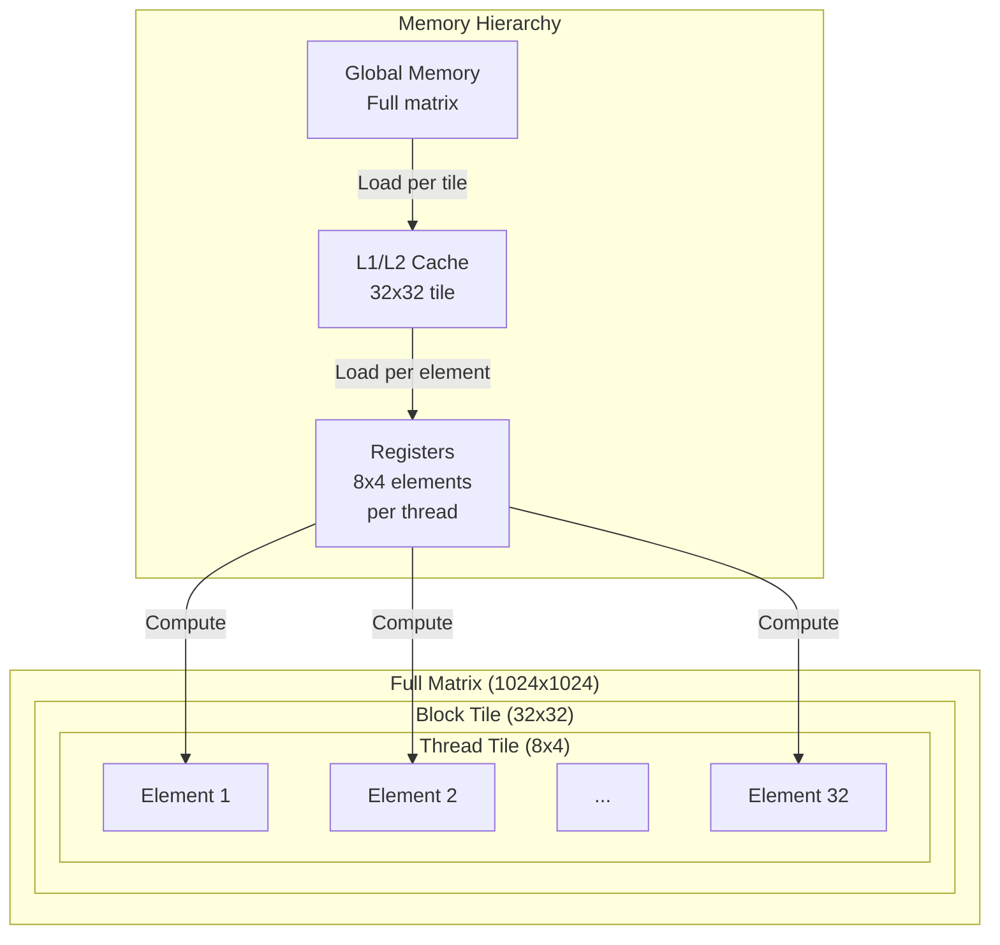

# Step 2: Tiling + Loop Reordering
Achieved 481 GFLOPS (5.1x improvement over Step 1)

## 1. Compiler Theory: Tiling and Loop Transformation

### Tiling (Blocking) - Loop Splitting for Cache

Tiling is a technique that divides large loops into small blocks (tiles). By doing so, we can increase the time data stays in fast-access memory (cache, shared memory).

Matrix multiplication is basically the following triple loop:

```fortran
! Basic form
do i = 1,N
  do j = 1,N
    do k = 1,N
      C(i,j) = C(i,j) + A(i,k) * B(k,j)
    enddo
  enddo
enddo
```

- When `N` is large, matrices `A`, `B`, `C` don't all fit in cache. Therefore, every time data is fetched, it must be read from slow memory (global memory).

**Applying Tiling** – split with tile size `t`:

```fortran
! Split j, k loops into tiles
do j = 1,N,t
  do k = 1,N,t
    do i = 1,N
      do jj = j, min(j+t-1,N)
        do kk = k, min(k+t-1,N)
          C(i,jj) = C(i,jj) + A(i,kk) * B(kk,jj)
        enddo
      enddo
    enddo
  enddo
enddo
```

- When loops are split with tile size `t`, the data processed at once becomes smaller (`N x N` → `t × t`), so it can fit in cache.
- Transforming the iteration space in this way is called an **affine transform**.

### Loop Reordering - Maximizing Data Reuse

By changing the loop order together with tiling, we can maximize reuse in registers.

**Core Principle**:
- Variables in the innermost loop stay in registers continuously
- Placing `k` in the innermost loop makes `C[i,j]` stay in a register while we accumulate over `k`

## 2. TVM TensorIR Implementation

On GPU we use two levels of tiling:

1. **Block-level tiling**: GPU block-level tiling
2. **Thread-level tiling**: per-thread workload (considering register pressure)

### 2-Level Tiling

```python
# Block-level tiling (GPU block)
BM, BN, BK = 32, 32, 32  # Small tiles (optimal for A500 cache)

# Thread-level tiling (work per thread)
TM, TN = 8, 4  # High ILP

threads_x = BM // TM  # 4
threads_y = BN // TN  # 8

# Create tiles with split
i_block, i_rest = sch.split(i, factors=[None, BM])
j_block, j_rest = sch.split(j, factors=[None, BN])
k_outer, k_inner = sch.split(k, factors=[None, BK])

i_thread, i_elem = sch.split(i_rest, factors=[threads_x, None])
j_thread, j_elem = sch.split(j_rest, factors=[threads_y, None])
```

- `sch.split` is a function that divides a long loop into multiple loops.
  - `i_block, i_rest = sch.split(i, factors=[None, BM])`: fix the inner loop size to `BM` (32), and let TVM infer the outer loop extent (`None`).
  - `i_rest` becomes the inner loop that runs `BM` times, and `i_block` becomes the outer loop that runs `M / BM` times.
- The optimal values of `BM`, `BN`, `BK`, `TM`, `TN` were obtained through the parameter search in Section 4.

### Loop Reordering: putting `k_inner` in the innermost position

```python
# Key idea: put k_inner in the innermost position
sch.reorder(
    i_block, j_block,      # which block (tile) to process
    i_thread, j_thread,    # thread layout inside the block
    k_outer,               # tile-level loop over K
    i_elem, j_elem,        # elements per thread
    k_inner                # innermost loop – maximize register reuse
)

# Map loops to GPU hardware
sch.bind(i_block, "blockIdx.x")
sch.bind(j_block, "blockIdx.y")
sch.bind(i_thread, "threadIdx.x")
sch.bind(j_thread, "threadIdx.y")
```

If we place `k_inner` outside of the innermost position:

- `C` cannot stay in a register for the whole `k` accumulation.
- We end up repeating the read–modify–write cycle on `C` `K` times.
- Cache space reserved for `A`/`B` tiles can be polluted by unnecessary `C` traffic.

## 3. Generated Execution Pattern

Conceptually, TVM generates a CUDA kernel with the following structure:

```python
for i_block in blockIdx.x:          # select block
  for j_block in blockIdx.y:
    for i_thread in threadIdx.x:    # thread layout
      for j_thread in threadIdx.y:
        for k_outer in range(32):   # iterate over K tiles
          # each thread computes 8x4 = 32 elements
          for i_elem in range(8):
            for j_elem in range(4):
              for k_inner in range(32):  # innermost
                # A[i,k], B[k,j], C[i,j] are all reused from registers
                C[i,j] += A[i,k] * B[k,j]
```

### Tiling Structure Visualization



## 4. Experiment: Sweeping 138 Configurations

### Parameter Sweep

```bash
# Automatically test 138 configurations
python test_individual/step2_parameter_sweep.py
```

Configurations tested:

- **Block Tile**: 32x32x32, 32x64x32, 64x32x32, 64x64x32, 64x64x64  
- **Thread Tile**: 2x2, 4x4, 4x8, 8x4, 8x8  
- **Loop Pattern**: `standard`, `k_after_threads`, `k_innermost`

### Findings

#### (1) Effect of Loop Reordering

| Pattern          | Avg   | Best   | Description                    |
|------------------|-------|--------|--------------------------------|
| standard         | 19 GFLOPS | 68 GFLOPS  | `k` loop comes first         |
| k_after_threads  | 19 GFLOPS | 68 GFLOPS  | `k` after thread loops       |
| k_innermost      | 171 GFLOPS | 482 GFLOPS | `k` in the innermost loop   |

#### (2) Small Tiles Work Best on A500

| Tile Size  | Avg   | Best   |
|-----------|-------|--------|
| 32x32x32  | 130 GFLOPS | 482 GFLOPS |
| 64x64x64  | 59 GFLOPS  | 254 GFLOPS |

#### (3) High ILP (Thread Tile) is Critical

| Thread Tile | Threads   | Avg   | Best   | Registers / thread |
|-------------|----------|-------|--------|--------------------|
| 8x4         | 32–128   | 109 GFLOPS | 482 GFLOPS | 32–64               |
| 4x4         | 64–256   | 77 GFLOPS  | 324 GFLOPS | 16                  |
| 2x2         | 256–1024 | 37 GFLOPS  | 164 GFLOPS | 4                   |

The best configuration is `TM = 8`, `TN = 4`:

- Each thread computes 32 output elements.
- High instruction-level parallelism (ILP).
- Good balance between register pressure and ILP.

## 3. Results

### Performance

| Matrix Size | Step 1 | Step 2 | Improvement |
|----------|--------|--------|------|
| 512x512 | 91 GFLOPS | 466 GFLOPS | 5.1x |
| 1024x1024 | 95 GFLOPS | 482 GFLOPS | 5.1x |


Average: 390 GFLOPS

### Optimal Configuration

```python
# Best performance setting (482 GFLOPS)
BM, BN, BK = 32, 32, 32  # Fit in L1 cache
TM, TN = 8, 4            # High ILP
Threads = 32 (4 x 8)     # High ILP with fewer threads
Pattern = "k_innermost"  # Maximize register reuse
```

### Theoretical Analysis

**A500 Peak Performance**:

- 1024 FP32 cores × 2 ops/cycle × 1.5 GHz = 3.072 TFLOPS  
- Achieved: 482 GFLOPS = 0.482 TFLOPS  
- Efficiency: 15.7%

## Execution

```bash
# Basic execution
python test_individual/test_step2_improved.py

# Parameter search (138 configurations)
python test_individual/step2_parameter_sweep.py
```

Code can be found at [https://github.com/kimm240/matrix-multiplication-optimization-with-tvm](https://github.com/kimm240/matrix-multiplication-optimization-with-tvm).

---

**Series Posts**

- Previous: [Step 1: Simple GPU Binding](/posts/2025/12/tvm-matmul-optimization-step1-en/)
- Next: [Step 3: Shared Memory](/posts/2025/12/tvm-matmul-optimization-step3-en/)

**Language**: [한국어 (Korean)](/posts/2025/12/tvm-matmul-optimization-step2/)

