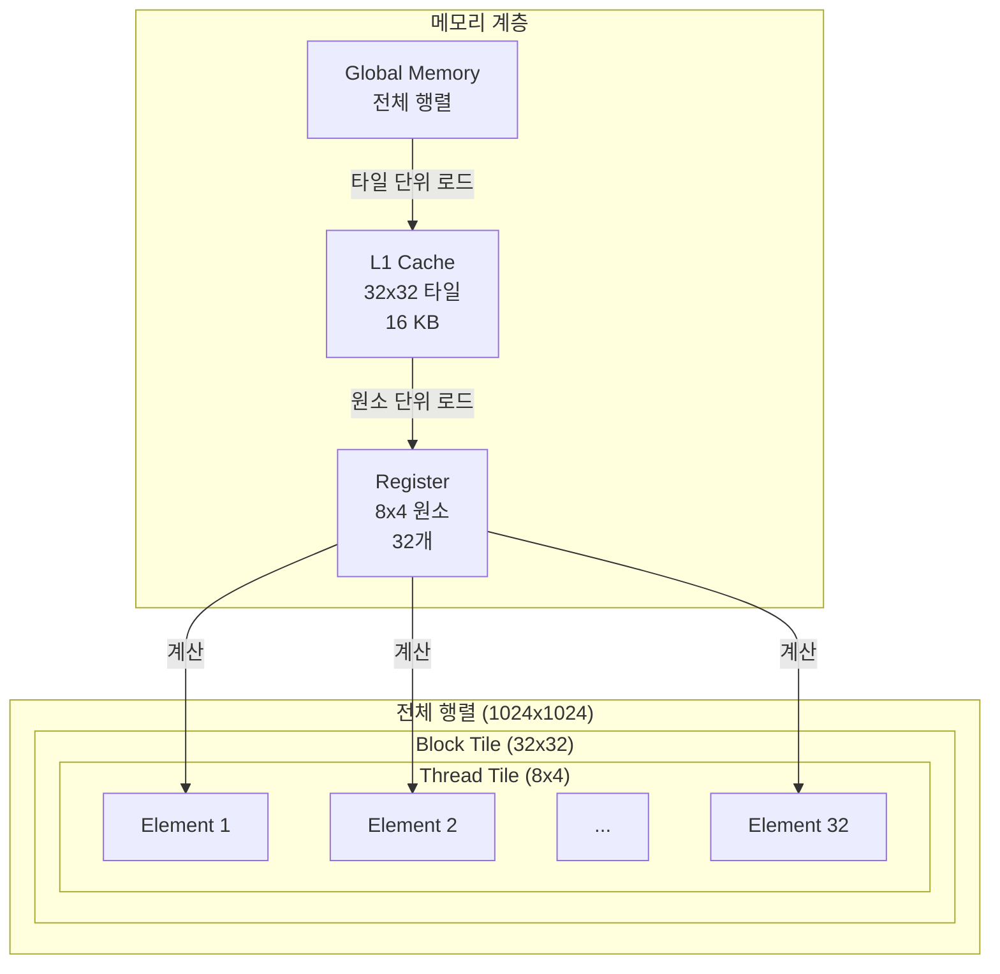

# Step 2: Tiling + Loop Reordering
481 GFLOPS 달성 (Step 1 대비 5.1배 향상)

## 1. 컴파일러 이론: Tiling과 Loop Transformation

### Tiling (Blocking) - 캐시를 위한 루프 분할

Tiling은 큰 루프를 작은 블록(타일)으로 나누는 기법입니다. 그렇게 함으로써, 데이터가 접근이 빠른 메모리(캐시, Shared Memory)에 머무르는 시간을 늘릴 수 있습니다.

Matrix Multiplication은 기본적으로 다음과 같은 3중 루프입니다:

```fortran
! 기본 형태
do i = 1,N
  do j = 1,N
    do k = 1,N
      C(i,j) = C(i,j) + A(i,k) * B(k,j)
    enddo
  enddo
enddo
```

- `N`이 크면 `A`, `B`, `C` 행렬이 캐시에 다 들어가지 않습니다. 따라서 데이터를 가져올 때마다, 접근이 느린 메모리에서 데이터를 읽어와야 합니다.

**Tiling 적용** - 타일 크기 t로 분할:

```fortran
! j, k 루프를 타일로 분할
do j = 1,N,t
  do k = 1,N,t
    do i = 1,N
      do jj = j, min(j+t-1,N)
        do kk = k, min(k+t-1,N)
          C(i,jj) = C(i,jj) + A(i,kk) * B(kk,jj)
        enddo
      enddo
    enddo
  enddo
enddo
```

- 루프를 타일 크기 `t`로 분할할 경우, 한 번에 처리하는 데이터가 작아져서 (`N x N` -> `t × t`) 캐시에 들어갈 수 있습니다.
- 이렇게 반복 공간을 변환하는 것을 **Affine Transform**이라고 합니다.

### Loop Reordering - 데이터 재사용 극대화

Tiling과 함께 루프의 순서를 바꾸면 레지스터에서의 재사용을 극대화할 수 있습니다.

**핵심 원리**:
- 가장 안쪽 루프의 변수는 레지스터에 계속 머무름
- k를 가장 안쪽에 두면 `A[i,k]`, `B[k,j]`, `C[i,j]`가 모두 레지스터에 상주

## 2. TVM TensorIR 구현

GPU는 2단계 타일링이 필요합니다:
1. **Block-level Tiling**: GPU 블록 단위 (Shared Memory 크기 고려)
2. **Thread-level Tiling**: 각 스레드의 작업량 (레지스터 크기 고려)

### 2-Level Tiling

```python
# Block-level tiling (GPU 블록)
BM, BN, BK = 32, 32, 32  # 작은 타일! (A500 캐시에 최적)

# Thread-level tiling (스레드별 작업)
TM, TN = 8, 4  # 높은 ILP

threads_x = BM // TM  # 4
threads_y = BN // TN  # 8

# Split으로 타일 생성
i_block, i_rest = sch.split(i, factors=[None, BM])
j_block, j_rest = sch.split(j, factors=[None, BN])
k_outer, k_inner = sch.split(k, factors=[None, BK])

i_thread, i_elem = sch.split(i_rest, factors=[threads_x, None])
j_thread, j_elem = sch.split(j_rest, factors=[threads_y, None])
```

- `sch.split`은 긴 루프를 여러 개의 루프로 나누는 함수입니다.
    - `i_block, i_rest = sch.split(i, factors=[None, BM])`: 안쪽 루프의 크기를 `BM`(32)으로 고정하고, 바깥쪽 루프는 알아서 계산해달라는 의미입니다. (`None`)
    - `i_rest`는 `BM`번 도는 안쪽 루프가 되고, `i_block`은 `M / BM`번 도는 바깥쪽 루프가 됩니다.
- 이 때, 최적의 BM, BN, BK, TM, TN의 값은 Section 4의 과정을 거쳐서 발견했습니다.

### Loop Reordering: k_inner을 가장 안쪽에 배치하는 패턴

```python
# 핵심: k_inner를 가장 안쪽에!
sch.reorder(
    i_block, j_block,      # 어떤 블록(타일)을 처리할지
    i_thread, j_thread,    # 블록 내 스레드 배치
    k_outer,               # K 차원 타일 반복
    i_elem, j_elem,        # 각 스레드가 처리할 원소
    k_inner                # 가장 안쪽! - 레지스터 재사용 극대화
)

# GPU 하드웨어 매핑
sch.bind(i_block, "blockIdx.x")
sch.bind(j_block, "blockIdx.y")
sch.bind(i_thread, "threadIdx.x")
sch.bind(j_thread, "threadIdx.y")
```

- `k_inner`를 바깥에 배치할 경우,
    - `C`행렬이 register에 계속 있지 못합니다.
    - `C`행렬을 불필요하게 "읽기-수정-쓰기"하는 사이클이 `K`번 반복됩니다.
    - `A`, `B`타일을 위해 확보된 캐시 공간이 `C`에 의해 오염될 수 있습니다.

## 3. 생성된 실행 패턴

```python
# TVM이 생성하는 CUDA 커널 구조 (개념적)
for i_block in blockIdx.x:          # 블록 선택
  for j_block in blockIdx.y:
    for i_thread in threadIdx.x:    # 스레드 배치
      for j_thread in threadIdx.y:
        for k_outer in range(32):   # 타일 단위 반복
          # 각 스레드가 8x4 = 32개 원소 처리
          for i_elem in range(8):
            for j_elem in range(4):
              for k_inner in range(32):  # 가장 안쪽!
                # A[i,k], B[k,j], C[i,j] 모두 레지스터에서 재사용
                C[i,j] += A[i,k] * B[k,j]
```

#### Tiling 구조 시각화


## 4. 실험: 138개 설정 자동 탐색

### 파라미터 탐색

```bash
# 자동으로 138개 설정 테스트
python test_individual/step2_parameter_sweep.py
```

테스트한 조합:
- **Block Tile**: 32x32x32, 32x64x32, 64x32x32, 64x64x32, 64x64x64
- **Thread Tile**: 2x2, 4x4, 4x8, 8x4, 8x8
- **Loop Pattern**: standard, k_after_threads, k_innermost

### 발견

#### (1) Loop Reordering

| Pattern | 평균 | 최고 | 설명 |
|---------|------|------|------|
| standard | 19 GFLOPS | 68 GFLOPS | k를 먼저 반복 |
| k_after_threads | 19 GFLOPS | 68 GFLOPS | k를 thread 다음에 |
| k_innermost | 171 GFLOPS | 482 GFLOPS | k를 가장 안쪽에 |

#### (2) 작은 타일이 A500에 최적

| 타일 크기 | 평균 | 최고 | 메모리 사용 |
|----------|------|------|-----------|
| 32x32x32 | 130 GFLOPS | 482 GFLOPS | 16 KB |
| 64x64x64 | 59 GFLOPS | 254 GFLOPS | 1 MB |

A500 특성:
- L1 캐시: 32 KB/SM
- L2 캐시: 2 MB (전체)
- 32x32x32 타일 (16 KB) → L1에 fit
- 64x64x64 타일 (1 MB) → L1 초과, 캐시 미스 증가

#### (3) 높은 ILP (Thread Tile)가 중요

| Thread Tile | Threads | 평균 | 최고 | 레지스터/스레드 |
|------------|---------|------|------|----------------|
| 8x4 | 32-128 | 109 GFLOPS | 482 GFLOPS | 32-64 |
| 4x4 | 64-256 | 77 GFLOPS | 324 GFLOPS | 16 |
| 2x2 | 256-1024 | 37 GFLOPS | 164 GFLOPS | 4 |

TM=8, TN=4가 최적:
- 각 스레드가 32개 원소 계산
- 높은 Instruction-Level Parallelism
- 레지스터 압력과 ILP의 최적 균형

## 5. 결과

### 성능

| 행렬 크기 | Step 1 | Step 2 | 향상 |
|----------|--------|--------|------|
| 512x512 | 91 GFLOPS | 466 GFLOPS | 5.1x |
| 1024x1024 | 95 GFLOPS | 482 GFLOPS | 5.1x |
| 2048x2048 | - | 222 GFLOPS | - |

평균: 390 GFLOPS

### 최적 설정

```python
# 최고 성능 설정 (482 GFLOPS)
BM, BN, BK = 32, 32, 32  # L1 캐시에 fit
TM, TN = 8, 4            # 높은 ILP
Threads = 32 (4 x 8)     # 적은 스레드로 높은 ILP
Pattern = "k_innermost"  # 레지스터 재사용 극대화
```

### 이론적 분석

**A500 Peak Performance**:
- 1024 FP32 cores × 2 ops/cycle × 1.5 GHz = 3.072 TFLOPS
- 달성: 482 GFLOPS = 0.482 TFLOPS
- 효율: 15.7%

## 실행

```bash
# 기본 실행
python test_individual/test_step2_improved.py

# 파라미터 탐색 (138개 설정)
python test_individual/step2_parameter_sweep.py
```

코드는 [https://github.com/kimm240/matrix-multiplication-optimization-with-tvm](https://github.com/kimm240/matrix-multiplication-optimization-with-tvm)에서 찾아볼 수 있습니다.

---

**시리즈 포스트**

- 이전: [Step 1: Simple GPU Binding](/posts/2025/12/tvm-matmul-optimization-step1/)
- 다음: [Step 3: Shared Memory](/posts/2025/12/tvm-matmul-optimization-step3/)

