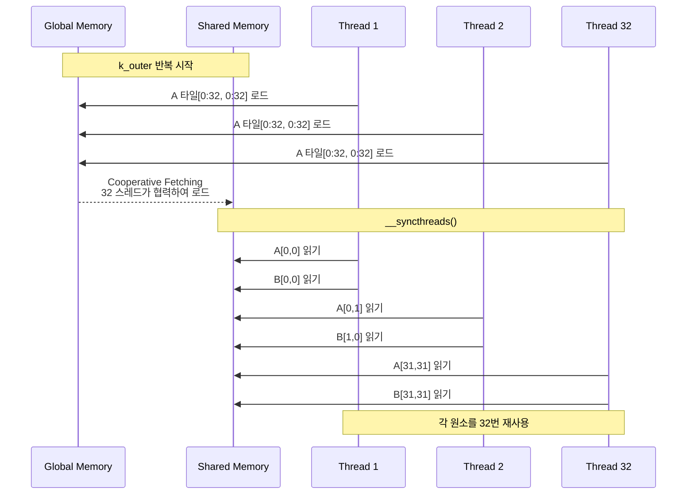

# Step 3: Shared Memory

## 성과

| 행렬 크기 | Step 2 | Step 3 | 개선율 |
|----------|--------|--------|--------|
| 512x512 | 466 GFLOPS | 415 GFLOPS | -11% |
| 1024x1024 | 482 GFLOPS | 460 GFLOPS | -5% |
| 2048x2048 | 222 GFLOPS | 446 GFLOPS | +101% |

평균: 440 GFLOPS

## 1. 컴파일러 이론: Memory Hierarchy Optimization

### GPU 메모리 계층과 Shared Memory의 역할

접근 속도가 빠른 Memory를 최대한 활용하면 성능 개선을 할 수 있습니다.

**A500 메모리 계층**:

```
글로벌 메모리 (4 GB, 192 GB/s)
  - 크지만 느림
  - 모든 SM이 공유
    ↓
L2 캐시 (2 MB)
  - 하드웨어 관리 (자동)
  - 예측 불가능
    ↓
Shared Memory (64 KB/SM)
  - 프로그래머가 명시적으로 관리
  - 블록 내 모든 스레드가 공유
  - 글로벌 메모리보다 10-100배 빠름
    ↓
레지스터 (256 KB/SM)
  - 가장 빠름
  - 각 스레드 전용
```

### Shared Memory 활용

Shared Memory는 이 공간적 지역성을 활용합니다:
타일(32×32) 단위로 데이터를 Shared Memory에 로드합니다. 그렇게 함으로써 블록 내 모든 스레드(32개)를 재사용할 수 있습니다. 그리고, 각 원소를 32번 재사용할 수 있습니다.

#### Shared Memory 캐싱 흐름



## 2. TVM TensorIR 구현

### Shared Memory Caching

```python
# Shared Memory에 타일 캐싱
A_shared = sch.cache_read(block, 0, "shared")
B_shared = sch.cache_read(block, 1, "shared")

# k_outer 레벨에서 타일 단위로 shared memory에 배치
sch.compute_at(A_shared, k_outer)
sch.compute_at(B_shared, k_outer)
```

위 TVM TensorIR이 의미하는 바는 아래와 같습니다.

```python
for k_outer:  # 32번 타일 반복
    # Shared Memory에 32×32 타일 로드
    A_shared[32×32] = A_global[...]
    B_shared[32×32] = B_global[...]
    
    for i_elem, j_elem, k_inner:
        C[i,j] += A_shared[i,k] * B_shared[k,j]
```

### Cooperative Fetching

32x32=1024개 원소를 Shared Memory에 로드할 때, 32개의 스레드가 각 스레드당 32개의 원소를 로드합니다.

```python
for cache_block in [A_shared, B_shared]:
    fused = sch.fuse(*loops[-2:])
    f_ty, f_tx = sch.split(fused, factors=[threads_y, None])
    sch.bind(f_tx, "threadIdx.x")
    sch.bind(f_ty, "threadIdx.y")
```

- `sch.fuse(*loops[-2:])`: `scp.fuse`는 여러 개의 루프를 한 개의 루프로 연결합니다. 즉 해당 명령어는 `loops`의 마지막 2개의 loop를 한 개의 루프로 연결합니다.
- `sch.split(fused, factors=[threads_y, None])`: `split`은 fused된 루프를 다시 `threads.y`(스레드 블록의 y차원 크기)로 나눕니다. 이렇게 해서 GPU의 2D 스레드 구조에 맞게 분배할 수 있습니다.

위 2과정 이후의 TensorIR 구조는 다음과 같습니다.

```python
// "1024개 작업을 8개의 덩어리로 나누고, 각 덩어리는 128개다"
for (f_ty in 0..7) {
    for (f_tx in 0..127) {
        // f_ty, f_tx를 조합하여 원래의 fused 값을 계산
        // fused = f_ty * 128 + f_tx;
        ...
    }
}
```

- `sch.bind(f_tx, "threadIdx.x")`: `bind`는 `f_ty`, `f_tx` 루프를 실제 GPU의 Thread ID에 묶습니다.

최종 TensorIR 구조는 다음과 같습니다.

```python
// bind 후 생성되는 최종 CUDA 코드의 개념
// 이 코드는 32개의 스레드에서 동시에 실행됩니다.

// 1. 각 스레드는 자신의 하드웨어 ID를 가져옵니다.
int tx = threadIdx.x; // 0..3
int ty = threadIdx.y; // 0..7

// 2. ID를 기반으로 자신이 맡을 작업 범위를 계산합니다.
//    (1024개 작업을 32개 스레드가 32개씩 나눠 가짐)
for (i = 0; i < 32; ++i) {
    int element_index = (ty * 4 + tx) * 32 + i; // 각 스레드가 맡을 32개 원소의 인덱스

    // 3. 계산된 인덱스로 데이터 로딩 수행
    int src_ax0 = element_index / 32;
    int src_ax1 = element_index % 32;
    A_shared[src_ax0, src_ax1] = A_global[...];
}
```

## 3. 결과 분석

Shared Memory를 쓴다고 무조건 성능 개선을 할 수 있지는 않습니다. Global Memory에서 Shared Memory로 복사하는 비용과, `__syncthreads()` 동기화 비용이 발생하기 때문입니다. 이는 512x512와 1024x1024의 결과에서 확인할 수 있습니다.

하지만, 2048×2048에서는 +101% 향상했습니다. 캐싱하고자 하는 데이터가 L2 캐시(2 MB)의 크기를 초과하여, 캐시 미스가 증가하는 경우이기 때문입니다. 이 때, Shared Memory가 캐시 역할을 하여, 글로벌 메모리로의 접근을 대폭 감소합니다.

## 실행

```bash
python test_individual/test_step3_with_threads.py
```

코드는 [https://github.com/kimm240/matrix-multiplication-optimization-with-tvm](https://github.com/kimm240/matrix-multiplication-optimization-with-tvm)에서 찾아볼 수 있습니다.

---

**시리즈 포스트**

- 이전: [Step 2: Tiling + Loop Reordering](/posts/2025/12/tvm-matmul-optimization-step2/)
- 다음: [Step 4: Vectorization + Local Memory](/posts/2025/12/tvm-matmul-optimization-step4/)

**Language**: [English](/posts/2025/12/tvm-matmul-optimization-step3-en/)

