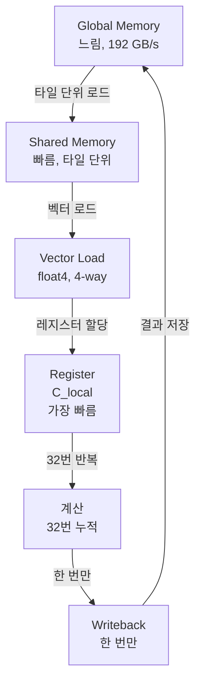
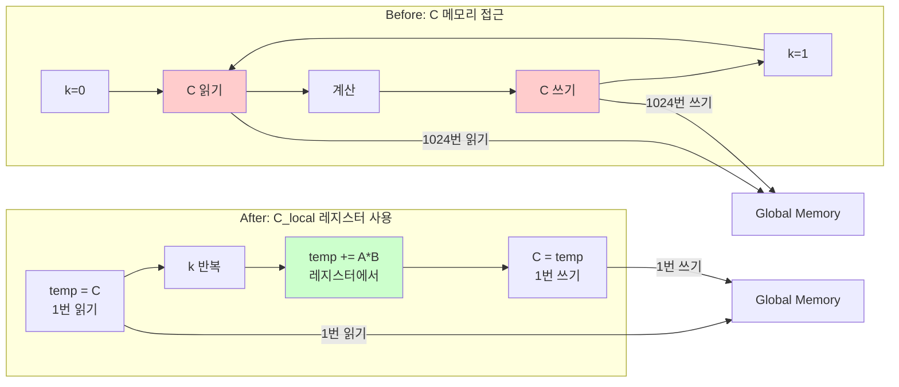

# Step 4: Vectorization + Local Memory

## 성과

| 행렬 크기 | Step 4 | 개선율 |
|----------|--------|--------|
| 512x512 | 804 GFLOPS | +94% |
| 1024x1024 | 593 GFLOPS | +29% |
| 2048x2048 | 549 GFLOPS | +23% |

평균: 614 GFLOPS

## 1. 컴파일러 이론: Scalar Replacement (Register Pipelining)

### 기본 아이디어

배열의 반복적인 접근을 스칼라 변수로 대체하여 레지스터에 할당합니다.

행렬 곱셈에서 `C[i,j]`는 K번 (여기에선, 1024번) 누적됩니다:

```python
# 기존: C[i,j]를 매번 메모리에서 읽고 쓰기
for k in range(1024):
    C[i,j] = C[i,j] + A[i,k] * B[k,j]
```

- 이렇게 할 경우, `C[i, j]`에 1024번 읽기, 1024번 쓰기 요청을 하게 됩니다. 즉, 2048번 메모리 접근을 하게 됩니다.
- `C[i, j]`에 저장할 값을 스칼라 변수에 할당하고, 스칼라 변수를 `local memory`(GPU에서는 `register`)에 저장하는 방식을 활용하면, 아래와 같은 상황을 만들 수 있습니다.

```python
# C[i,j]를 스칼라 변수 temp로 대체
temp = C[i,j]  # 1번 읽기
for k in range(1024):
    temp = temp + A[i,k] * B[k,j]
    # 레지스터에서 누적됨.
C[i,j] = temp  # 1번 쓰기
```

- `register`접근은 메모리 접근으로 치지 않는다는 전제 하에서, 메모리 접근 횟수를 2048번에서 2번으로 줄일 수 있습니다.

## 2. TVM TensorIR 구현

### C_local: GPU의 Scalar Replacement

```python
# Local memory (레지스터) 캐싱
C_local = sch.cache_write(block, 0, "local")
sch.reverse_compute_at(C_local, k_outer)
```

- `sch.cache_write(block, 0, "local")`: `cache_write`는 쓰기 작업을 위한 임시 버퍼를 만드는 명령어입니다. `"local"`이라는 지시자를 넣음으로써, 그 버퍼를 `register`에 만들 수 있습니다.

- `sch.reverse_compute_at(C_local, k_outer)`: 계산이 끝난 결과(`C_local`)을 언제(`k_outer`) 저장할지 명시해주는 명령어입니다.

**의미**:

```python
for k_outer:  # 타일 반복
    # C_local을 레지스터에 할당 (8x4 = 32개 원소)
    C_local[8x4] = 0
    
    for k_inner:  # 32번 반복
        # 레지스터에서 누적
        C_local[i,j] += A_shared[i,k] * B_shared[k,j]
    
    # 레지스터 → 글로벌 메모리
    C[i,j] = C_local[i,j]
```

### Vectorization: 메모리 대역폭 활용

```python
# float4 (16 bytes) 벡터 로드
vector_size = 4
sch.vectorize(f_vec)
```

효과: +5-6% (보조적 역할)

## 4. 결과

### 성능 분석

Step 3 → Step 4 (512x512):
- Step 3: 415 GFLOPS
- + Vectorization만: 약 436 GFLOPS (+5%)
- + C_local 추가: 804 GFLOPS (+94%)

### 메모리 계층 완전 활용



**Scalar Replacement 효과**:



메모리 접근 횟수가 2048번에서 2번으로 감소합니다.

## 실행

```bash
python test_individual/test_step4_final.py
```

코드는 [https://github.com/kimm240/matrix-multiplication-optimization-with-tvm](https://github.com/kimm240/matrix-multiplication-optimization-with-tvm)에서 찾아볼 수 있습니다.

---

**시리즈 포스트**

- 이전: [Step 3: Shared Memory](/posts/2025/12/tvm-matmul-optimization-step3/)
- 다음: [Step 5: Software Pipelining](/posts/2025/12/tvm-matmul-optimization-step5/)

**Language**: [English](/posts/2025/12/tvm-matmul-optimization-step4-en/)


