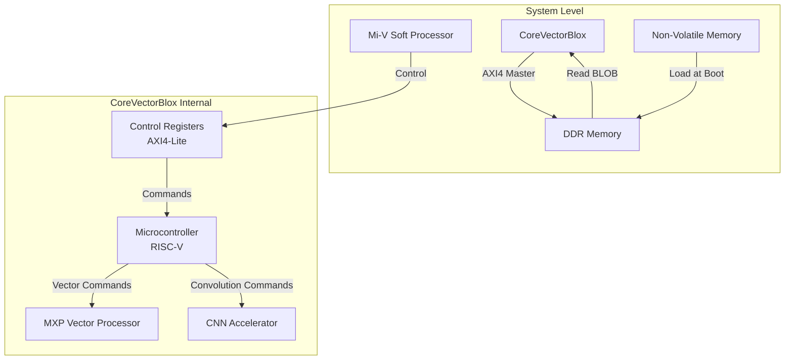

VectorBlox is an AI/ML inference accelerator platform for Microchip PolarFire FPGAs and SoCs. It enables AI model deployment without FPGA reprogramming through software-based implementation, optimized for edge AI applications with power efficiency under 5W.

## 1. VectorBlox Overview

### Supported Operators[^1]

The table below lists supported operators and their known limitations in VectorBlox.

| Operators | Known Limitations |
|----------|-------------------|
| ABS |  |
| ADD | **Fused activation function** = [0, NONE, RELU, RELU6] |
| ARG_MAX | **Axis** = [-1] |
| ARG_MIN | **Axis** = [-1] |
| AVERAGE_POOL_2D | **Fused activation function** = [0, NONE, RELU, RELU6], **Padding** = [SAME, VALID] |
| CONCATENATION | **Axis** = [-4, -3, -2, -1], **Fused activation function** = [0, NONE, RELU, RELU6] |
| CONV_2D | **Fused activation function** = [0, NONE, RELU, RELU6], **Padding** = [SAME, VALID] |
| DEPTHWISE_CONV_2D | **Fused activation function** = [0, NONE, RELU, RELU6], **Padding** = [SAME, VALID] |
| DEQUANTIZE |  |
| DIV | **Fused activation function** = [0, NONE, RELU, RELU6], **Others**: Input 2 must be a constant |
| ELU |  |
| EQUAL |  |
| EXP |  |
| EXPAND_DIMS | **Axis** = [-4, -3, -2, -1] |
| FULLY_CONNECTED | **Fused activation function** = [0, NONE, RELU, RELU6] |
| GATHER | **Axis** = [-4, -3, -2, -1] |
| GELU |  |
| GREATER | **Axis** = [-4, -3, -2, -1] |
| GREATER_EQUAL |  |
| HARD_SWISH |  |
| LEAKY_RELU |  |
| LESS |  |
| LESS_EQUAL |  |
| LOG |  |
| LOGISTIC |  |
| MAXIMUM |  |
| MAX_POOL_2D | **Fused activation function** = [0, NONE, RELU, RELU6], **Padding** = [SAME, VALID] |
| MEAN |  |
| MINIMUM |  |
| MUL | **Fused activation function** = [0, NONE, RELU, RELU6] |
| NEG |  |
| NOT_EQUAL |  |
| PACK | **Axis** = [-4, -3, -2, -1] |
| PAD |  |
| PADV2 |  |
| POW |  |
| PRELU |  |
| QUANTIZE |  |
| REDUCE_MAX | **Axis** = [-4, -3, -2, -1] |
| REDUCE_MIN | **Axis** = [-4, -3, -2, -1] |
| REDUCE_PROD | **Axis** = [-4, -3, -2, -1] |
| RELU |  |
| RELU6 |  |
| RELU_0_TO_1 |  |
| RELU_N1_TO_1 |  |
| RESHAPE |  |
| RESIZE_BILINEAR |  |
| RESIZE_NEAREST_NEIGHBOR |  |
| RSQRT |  |
| SILU |  |
| SLICE |  |
| SOFTMAX | **Dim** = [-3, -2, -1] |
| SPLIT | **Axis** = [-4, -3, -2, -1] |
| SPLIT_V | **Axis** = [-4, -3, -2, -1] |
| SQUEEZE | **Axis** = [-4, -3, -2, -1] |
| STRIDED_SLICE |  |
| SUB | **Fused activation function** = [0, NONE, RELU] |
| SUM | **Axis** = [-4, -3, -2, -1] |
| TANH |  |
| TILE |  |
| TRANSPOSE |  |
| TRANSPOSE_CONV | **Fused activation function** = [0, NONE, RELU, RELU6], **Padding** = [SAME, VALID] |
| UNPACK | **Axis** = [-4, -3, -2, -1] |
| CAST | **Others**: Cast inputs from INT8 or UINT8 to INT32 |

## 2. CoreVectorBlox IP[^2]

CoreVectorBlox is a neural network accelerator IP core for PolarFire FPGAs.

### Architecture

### Components

1. Control Registers: Control and status management through AXI4-Lite slave interface
2. Microcontroller: RISC-V based soft processor for network BLOB parsing and vector processor control
3. MXP Vector Processor: Vector processor for general neural network layers
4. CNN Accelerator: Dedicated accelerator for convolutional layers

### Memory Components

CoreVectorBlox stores the following three BLOBs (Binary Large Objects) in memory:

1. Firmware BLOB: Firmware common to all networks
2. Network BLOB: BLOB compiled by VectorBlox SDK for each network
3. Network I/O: Network input/output data

## 3. VectorBlox SDK[^3]

The compilation process is as follows:
- `.pth` (PyTorch model) → `.onnx` (ONNX model) → `.tflite` (TensorFlow Lite model) → `.vnnx` (VectorBlox model)

Use `torch.onnx.export()` to convert from `.pth` to `.onnx`, `onnx2tf --output_integer_quantized_tflite` to convert from `.onnx` to `.tflite`, and `vnnx_compile` command to convert from `.tflite` to `.vnnx`.

[^1]: https://github.com/Microchip-Vectorblox/VectorBlox-SDK/blob/master/docs/OPS.md
[^2]: [Aaron Severrance, Guy G.F. Lemieux,"Embedded Supercomputing in FPGAs with the VectorBlox MXP Matrix Processor", International Conference on Hardware/Software Codesign and System Synthesis, 2013, Montreal, QC, Canada](https://ieeexplore.ieee.org/document/6658993)
[^3]: https://github.com/Microchip-Vectorblox/VectorBlox-SDK/tree/master

---

**Language**: [한국어 (Korean)](/posts/2025/12/vectorblox-ai-accelerator/)

