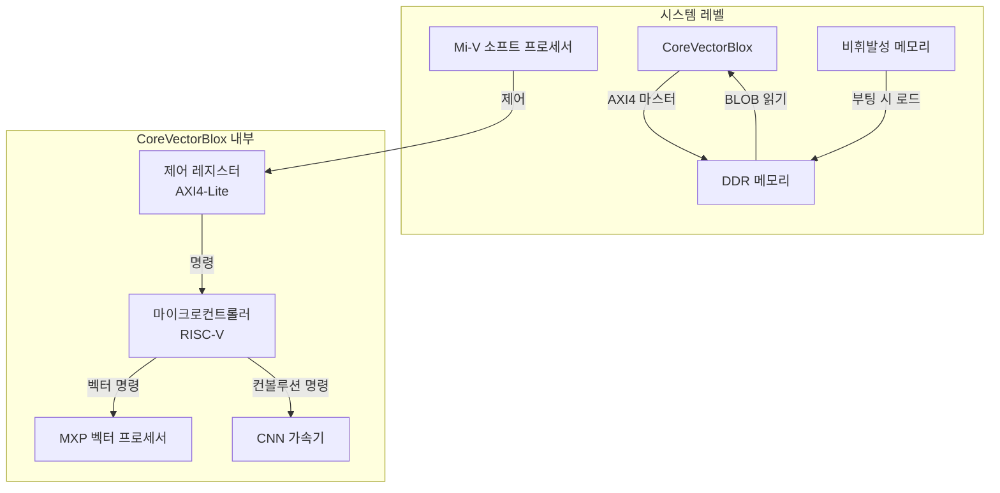

VectorBlox는 Microchip의 PolarFire FPGA 및 SoC를 위한 AI/ML 추론 가속기 플랫폼입니다. 소프트웨어 기반 구현을 통해 FPGA 재프로그래밍 없이 AI 모델을 배포할 수 있으며, 5W 미만의 전력 효율로 엣지 AI 애플리케이션에 최적화되어 있습니다.

## 1. VectorBlox 개요

### 지원하는 연산자[^1]

아래 표에 지원하는 연산자와, 각 연산자별로 VectorBlox에서의 제약 조건을 정리했습니다.

| Operators | Known Limitations |
|----------|-------------------|
| ABS |  |
| ADD | **Fused activation function** = [0, NONE, RELU, RELU6] |
| ARG_MAX | **Axis** = [-1] |
| ARG_MIN | **Axis** = [-1] |
| AVERAGE_POOL_2D | **Fused activation function** = [0, NONE, RELU, RELU6], **Padding** = [SAME, VALID] |
| CONCATENATION | **Axis** = [-4, -3, -2, -1], **Fused activation function** = [0, NONE, RELU, RELU6] |
| CONV_2D | **Fused activation function** = [0, NONE, RELU, RELU6], **Padding** = [SAME, VALID] |
| DEPTHWISE_CONV_2D | **Fused activation function** = [0, NONE, RELU, RELU6], **Padding** = [SAME, VALID] |
| DEQUANTIZE |  |
| DIV | **Fused activation function** = [0, NONE, RELU, RELU6], **Others**: Input 2 must be a constant |
| ELU |  |
| EQUAL |  |
| EXP |  |
| EXPAND_DIMS | **Axis** = [-4, -3, -2, -1] |
| FULLY_CONNECTED | **Fused activation function** = [0, NONE, RELU, RELU6] |
| GATHER | **Axis** = [-4, -3, -2, -1] |
| GELU |  |
| GREATER | **Axis** = [-4, -3, -2, -1] |
| GREATER_EQUAL |  |
| HARD_SWISH |  |
| LEAKY_RELU |  |
| LESS |  |
| LESS_EQUAL |  |
| LOG |  |
| LOGISTIC |  |
| MAXIMUM |  |
| MAX_POOL_2D | **Fused activation function** = [0, NONE, RELU, RELU6], **Padding** = [SAME, VALID] |
| MEAN |  |
| MINIMUM |  |
| MUL | **Fused activation function** = [0, NONE, RELU, RELU6] |
| NEG |  |
| NOT_EQUAL |  |
| PACK | **Axis** = [-4, -3, -2, -1] |
| PAD |  |
| PADV2 |  |
| POW |  |
| PRELU |  |
| QUANTIZE |  |
| REDUCE_MAX | **Axis** = [-4, -3, -2, -1] |
| REDUCE_MIN | **Axis** = [-4, -3, -2, -1] |
| REDUCE_PROD | **Axis** = [-4, -3, -2, -1] |
| RELU |  |
| RELU6 |  |
| RELU_0_TO_1 |  |
| RELU_N1_TO_1 |  |
| RESHAPE |  |
| RESIZE_BILINEAR |  |
| RESIZE_NEAREST_NEIGHBOR |  |
| RSQRT |  |
| SILU |  |
| SLICE |  |
| SOFTMAX | **Dim** = [-3, -2, -1] |
| SPLIT | **Axis** = [-4, -3, -2, -1] |
| SPLIT_V | **Axis** = [-4, -3, -2, -1] |
| SQUEEZE | **Axis** = [-4, -3, -2, -1] |
| STRIDED_SLICE |  |
| SUB | **Fused activation function** = [0, NONE, RELU] |
| SUM | **Axis** = [-4, -3, -2, -1] |
| TANH |  |
| TILE |  |
| TRANSPOSE |  |
| TRANSPOSE_CONV | **Fused activation function** = [0, NONE, RELU, RELU6], **Padding** = [SAME, VALID] |
| UNPACK | **Axis** = [-4, -3, -2, -1] |
| CAST | **Others**: Cast inputs from INT8 or UINT8 to INT32 |

## 2. CoreVectorBlox IP[^2]

CoreVectorBlox는 PolarFire FPGA용 신경망 가속기 IP 코어입니다.

### 아키텍처

### 구성 요소

1. 제어 레지스터: AXI4-Lite 슬레이브 인터페이스를 통한 제어 및 상태 관리
2. 마이크로컨트롤러: RISC-V 기반 소프트 프로세서로 네트워크 BLOB 파싱 및 벡터 프로세서 제어
3. MXP 벡터 프로세서: 일반적인 신경망 레이어 처리용 벡터 프로세서
4. CNN 가속기: 컨볼루션 레이어 전용 가속기

### 메모리 구성

CoreVectorBlox는 다음 세 가지 BLOB(Binary Large Object)을 메모리에 저장합니다:

1. Firmware BLOB: 모든 네트워크에 공통으로 사용되는 펌웨어
2. Network BLOB: VectorBlox SDK로 컴파일된 각 네트워크별 BLOB
3. Network I/O: 네트워크 입력/출력 데이터

## 3. VectorBlox SDK[^3]

컴파일 과정은 다음과 같습니다.
- `.pth`(Pytorch 모델) &rarr; `.onnx`(ONNX 모델) &rarr; `.tflite`(Tensorflow  Lite 모델) &rarr; `.vnnx`(VectorBlox 모델)

`.pth`에서 `.onnx`로  변환할 때 `torch.onnx.export()`를,  `.onnx`에서 `.tflite`로 변환할 때 `onnx2tf --output_integer_quantized_tflite`를, `.tflite`에서 `.vnnx`로 변환할  때 `vnnx_compile` 명령어를 사용합니다.

[^1]: https://github.com/Microchip-Vectorblox/VectorBlox-SDK/blob/master/docs/OPS.md
[^2]: [Aaron Severrance, Guy G.F. Lemieux,"Embedded Supercomputing in FPGAs with the VectorBlox MXP Matrix Processor", International Conference on Hardware/Software Codesign and System Synthesis, 2013, Montreal, QC, Canada](10.1109/CODES-ISSS.2013.6658993)
[^3]: https://github.com/Microchip-Vectorblox/VectorBlox-SDK/tree/master
---

