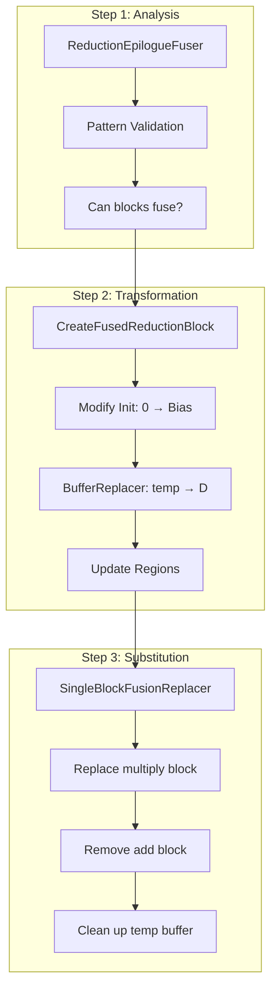
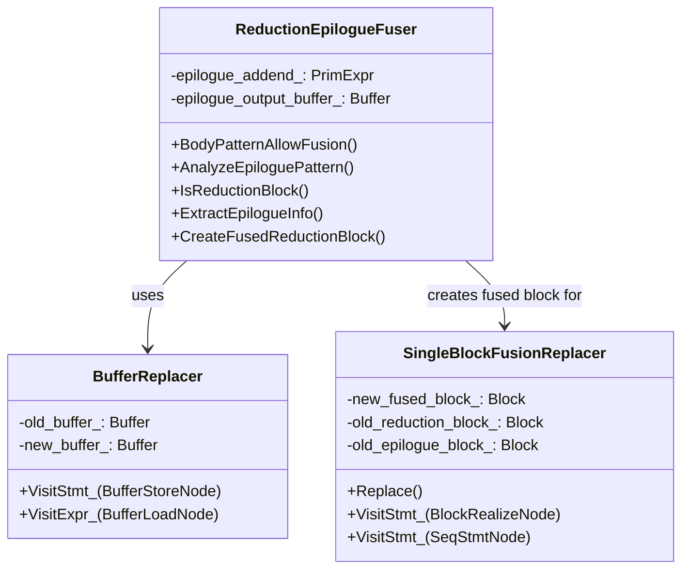
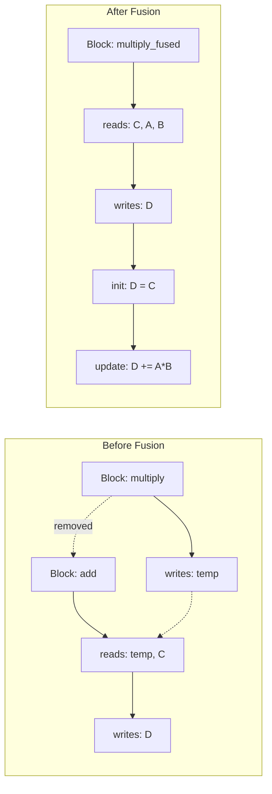
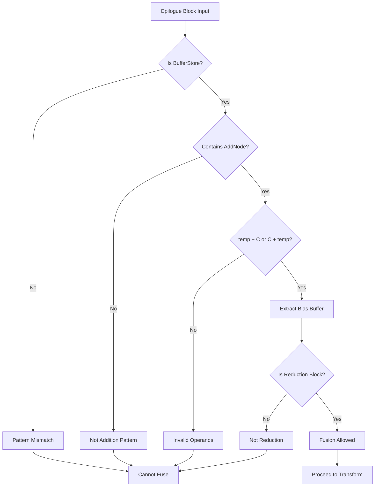
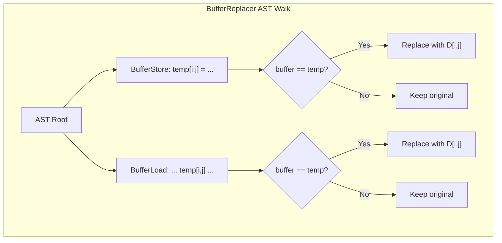
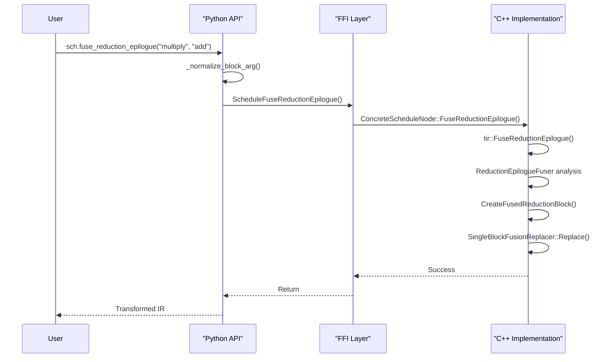

TVM's `FuseReductionEpilogue` primitive performs complex AST transformations. Let me explain the main components visually.

This guide visualizes the implementation content covered in Part 3, clearly showing how each stage connects and operates.

## Overall Architecture Flow

The FuseReductionEpilogue primitive operates as a pipeline composed of three stages. Each stage receives the results from the previous stage and passes them to the next stage.

In Step 1: Analysis, `ReductionEpilogueFuser` validates whether the two blocks can be fused. It verifies through pattern matching whether the Epilogue block is a simple addition form and whether the Reduction block is complete.

In Step 2: Transformation, validated blocks are fused. `CreateFusedReductionBlock` creates a new block, changes the Init statement from 0 to Bias, and `BufferReplacer` replaces all temp buffer references with the final output buffer D.

In Step 3: Substitution, `SingleBlockFusionReplacer` traverses the entire AST tree, removes existing blocks, and replaces them with the new fused block. Unnecessary temp buffer allocations are also removed together.

## Core Class Relationship Diagram

This class diagram shows the roles and relationships of the three core classes. `ReductionEpilogueFuser` is the main class that oversees analysis and transformation, uses `BufferReplacer` to perform buffer replacement, and creates fused blocks for `SingleBlockFusionReplacer`.

`ReductionEpilogueFuser` is the core class of the primitive, managing the entire process from pattern analysis to block creation. It maintains states like `epilogue_addend_` and `epilogue_output_buffer_` internally to pass necessary information during the transformation process.

`BufferReplacer` inherits from `StmtExprMutator` and traverses the AST to replace specific buffers with other buffers. This is used to replace all temp buffer references with the final output buffer.

`SingleBlockFusionReplacer` inherits from `StmtMutator` and performs the work of replacing or removing blocks from the entire tree. The existing Reduction block is replaced with the new fused block, and the Epilogue block is completely removed.

## AST Transformation Process Visualization

This diagram shows the block structure changes before and after fusion. In Before Fusion, two separate blocks exist: the `multiply` block writes to the temp buffer, and the `add` block reads temp and C and writes to D.

In After Fusion, only one fused block exists. This block reads C, A, B and writes directly to D, initializes D = C in the Init stage, and performs D += A*B in the Update stage. The separated blocks are removed and no longer exist.

## Pattern Analysis Detailed Flow

Pattern analysis goes through multiple stages of validation. First, it checks whether the Epilogue block is in `BufferStore` form, then verifies whether it contains an addition operation (`AddNode`). Once addition is confirmed, it checks whether the operands are in the form `temp + C` or `C + temp` to extract the Bias buffer.

Finally, it validates whether the Producer block is actually a Reduction block. All validations must pass for fusion to be allowed and proceed to the transformation stage. Failure at any stage makes fusion impossible and terminates the process.

## Buffer Replacement Mechanism

`BufferReplacer` traverses the AST in a depth-first search (DFS) manner. Starting from the AST root, it visits all `BufferStore` and `BufferLoad` nodes. At each node, it checks whether the buffer is the replacement target (temp), and if so, replaces it with the new buffer (D).

This process is performed recursively, and all buffer references inside nested blocks or loops are also processed. Buffers that are not replacement targets are kept as-is, so they don't affect other parts of the AST.

## Python API Connection Structure

This shows the call flow from Python API to C++ implementation. When a user calls `sch.fuse_reduction_epilogue()` from Python, it first normalizes block arguments. Then, the C++ function is called through the FFI (Foreign Function Interface) layer.

On the C++ side, `ConcreteScheduleNode::FuseReductionEpilogue()` is called, and internally the `tir::FuseReductionEpilogue()` function executes. This function sequentially performs the three stages (analysis, transformation, substitution) described earlier, then returns success or failure. Finally, the transformed IR is returned to Python and delivered to the user.

## Summary

Through this visualization guide, we can understand the overall architecture of the `FuseReductionEpilogue` primitive.

In the analysis stage, `ReductionEpilogueFuser` validates patterns and determines fusion feasibility, in the transformation stage, `CreateFusedReductionBlock` and `BufferReplacer` manipulate the AST to generate new fused blocks, and in the substitution stage, `SingleBlockFusionReplacer` removes existing blocks and replaces them with new blocks.

Through these three stages, MatMul and Bias Add can be fused into a single efficient Reduction Block.

---

**Series Posts**

- Previous: [Part 3. C++ Implementation](/posts/2025/12/tvm-fuse-reduction-epilogue-implementation-en/)
- Next: [Part 5. Testing Strategy and Validation](/posts/2025/12/tvm-fuse-reduction-epilogue-testing-en/)

**Language**: [한국어 (Korean)](/posts/2025/12/tvm-fuse-reduction-epilogue-architecture/)

