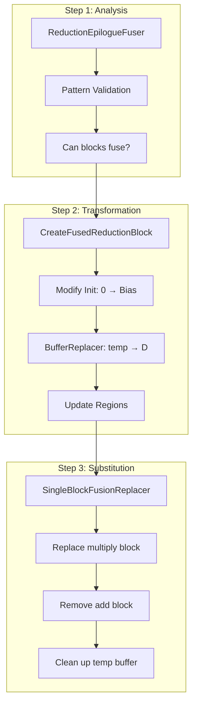
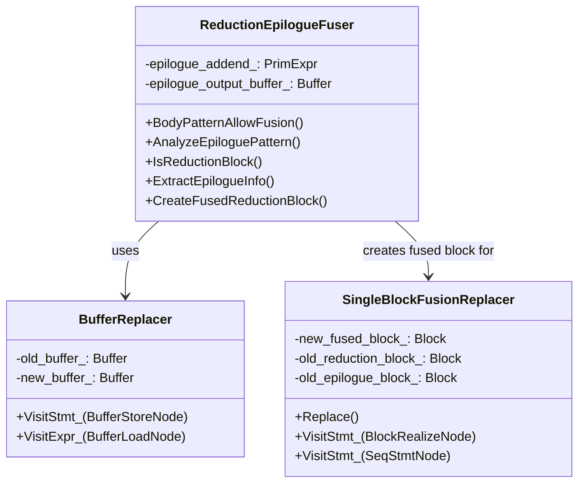
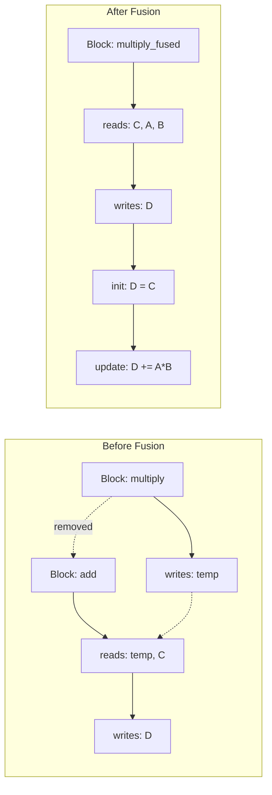
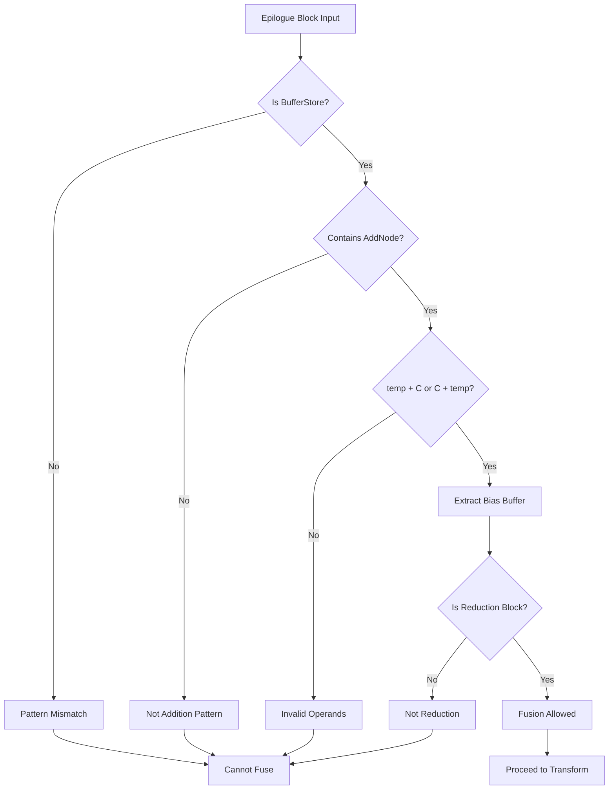
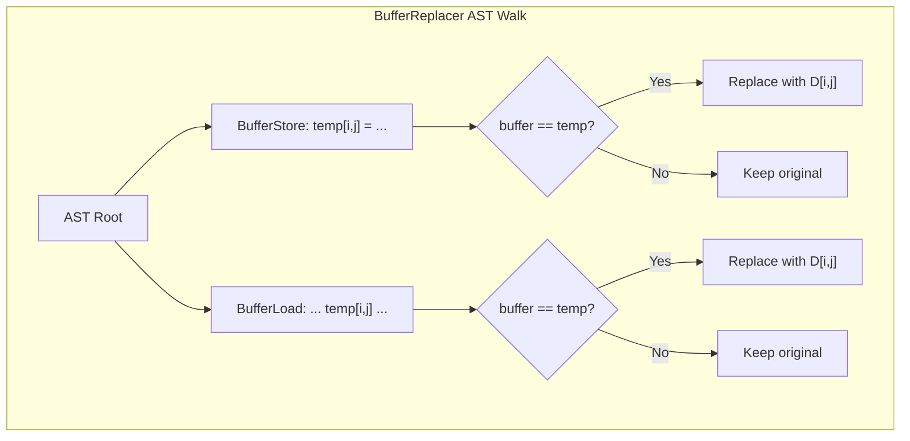
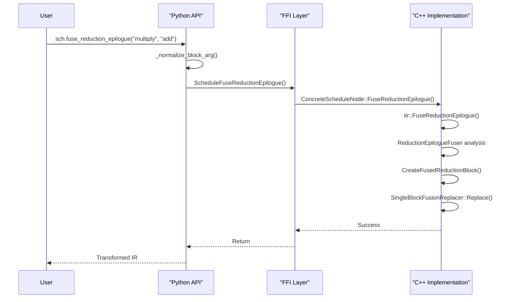

TVM의 `FuseReductionEpilogue` 프리미티브는 복잡한 AST 변환을 수행합니다. 주요 구성요소들을 시각적으로 이해할 수 있도록 설명드리겠습니다.

이 가이드는 Part 3에서 다룬 구현 내용을 시각화하여, 각 단계가 어떻게 연결되어 동작하는지 명확하게 보여줍니다.

## 전체 아키텍처 흐름

FuseReductionEpilogue 프리미티브는 세 단계로 구성된 파이프라인으로 동작합니다. 각 단계는 이전 단계의 결과를 받아 다음 단계로 전달하는 구조입니다.

Step 1: Analysis에서는 `ReductionEpilogueFuser`가 두 블록이 융합 가능한지 검증합니다. 패턴 매칭을 통해 Epilogue 블록이 단순 덧셈 형태인지, Reduction 블록이 완전한 형태인지 확인합니다.

Step 2: Transformation에서는 검증이 완료된 블록들을 융합합니다. `CreateFusedReductionBlock`이 새로운 블록을 생성하고, Init 구문을 0에서 Bias로 변경하며, `BufferReplacer`가 모든 temp 버퍼 참조를 최종 출력 버퍼 D로 교체합니다.

Step 3: Substitution에서는 `SingleBlockFusionReplacer`가 전체 AST 트리를 순회하며 기존 블록들을 제거하고 새 융합 블록으로 교체합니다. 불필요한 temp 버퍼 할당도 함께 제거됩니다.

## 핵심 클래스 관계도

이 클래스 다이어그램은 세 가지 핵심 클래스의 역할과 관계를 보여줍니다. `ReductionEpilogueFuser`는 분석과 변환을 총괄하는 메인 클래스이며, `BufferReplacer`를 사용하여 버퍼 교체를 수행하고, `SingleBlockFusionReplacer`를 위해 융합된 블록을 생성합니다.

`ReductionEpilogueFuser`는 프리미티브의 핵심 클래스로, 패턴 분석부터 블록 생성까지 전체 프로세스를 관리합니다. 내부적으로 `epilogue_addend_`와 `epilogue_output_buffer_` 같은 상태를 유지하여 변환 과정에서 필요한 정보를 전달합니다.

`BufferReplacer`는 `StmtExprMutator`를 상속받아 AST를 순회하며 특정 버퍼를 다른 버퍼로 교체하는 역할을 합니다. 이를 활용하여 모든 temp 버퍼 참조를 최종 출력 버퍼로 바꿔야 합니다.

`SingleBlockFusionReplace`는 `StmtMutator`를 상속받아 전체 트리에서 블록을 교체하거나 제거하는 작업을 수행합니다. 기존 Reduction 블록은 새 융합 블록으로 교체되고, Epilogue 블록은 완전히 제거됩니다.

## AST 변환 과정 시각화

이 다이어그램은 융합 전후의 블록 구조 변화를 보여줍니다. Before Fusion에서는 두 개의 분리된 블록이 존재합니다: `multiply` 블록은 temp 버퍼에 쓰고, `add` 블록은 temp와 C를 읽어서 D에 씁니다.

After Fusion에서는 하나의 융합된 블록만 존재합니다. 이 블록은 C, A, B를 읽고 D에 직접 쓰며, Init 단계에서 D = C로 초기화하고 Update 단계에서 D += A*B를 수행합니다. 분리된 블록들은 제거되어 더 이상 존재하지 않습니다.

## 패턴 분석 상세 흐름

패턴 분석은 여러 단계의 검증을 거칩니다. 먼저 Epilogue 블록이 `BufferStore` 형태인지 확인하고, 그 다음 덧셈 연산(`AddNode`)을 포함하는지 검사합니다. 덧셈이 확인되면 피연산자가 `temp + C` 또는 `C + temp` 형태인지 확인하여 Bias 버퍼를 추출합니다.

마지막으로 Producer 블록이 실제로 Reduction 블록인지 검증합니다. 모든 검증을 통과해야만 융합이 허용되고 변환 단계로 진행할 수 있습니다. 어느 단계에서든 실패하면 융합이 불가능하며 프로세스가 종료됩니다.

## 버퍼 교체 메커니즘

`BufferReplacer`는 AST를 깊이 우선 탐색(DFS) 방식으로 순회합니다. AST 루트에서 시작하여 모든 `BufferStore`와 `BufferLoad` 노드를 방문합니다. 각 노드에서 버퍼가 교체 대상(temp)인지 확인하고, 맞다면 새 버퍼(D)로 교체합니다.

이 과정은 재귀적으로 수행되며, 중첩된 블록이나 루프 내부의 모든 버퍼 참조도 처리합니다. 교체 대상이 아닌 버퍼는 그대로 유지되어 AST의 다른 부분에 영향을 주지 않습니다.

## Python API 연결 구조

Python API에서 C++ 구현까지의 호출 흐름을 보여줍니다. 사용자가 Python에서 `sch.fuse_reduction_epilogue()`를 호출하면, 먼저 블록 인자를 정규화합니다. 그 다음 FFI(Foreign Function Interface) 레이어를 통해 C++ 함수가 호출됩니다.

C++ 측에서는 `ConcreteScheduleNode::FuseReductionEpilogue()`가 호출되고, 내부적으로 `tir::FuseReductionEpilogue()` 함수가 실행됩니다. 이 함수는 앞서 설명한 세 단계(분석, 변환, 대체)를 순차적으로 수행한 후 성공 여부를 반환합니다. 최종적으로 변환된 IR이 Python으로 반환되어 사용자에게 전달됩니다.

## 요약

이 시각화 가이드를 통해 `FuseReductionEpilogue` 프리미티브의 전체 아키텍처를 이해할 수 있습니다.

분석 단계에서 `ReductionEpilogueFuser`가 패턴을 검증하고 융합 가능 여부를 판단하고, 변환 단계에서 `CreateFusedReductionBlock`과 `BufferReplacer`가 AST를 조작하여 새로운 융합 블록 생성하며, 대체 단계에서 `SingleBlockFusionReplacer`가 기존 블록을 제거하고 새 블록으로 교체합니다.

이 세 단계를 통해 MatMul과 Bias Add를 하나의 효율적인 Reduction Block으로 융합할 수 있게 됩니다.

