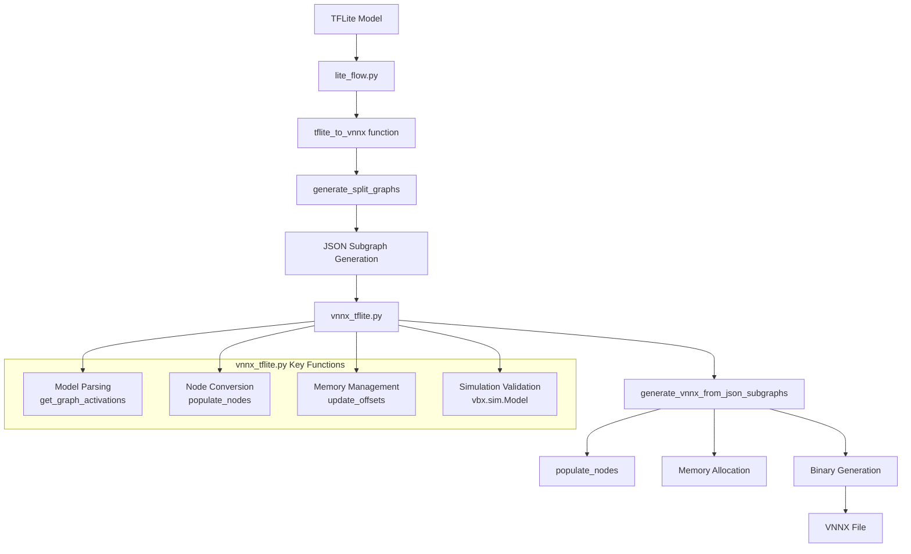

`vnnx_tflite.py` is a core module that converts TensorFlow Lite (INT8) models to VectorBlox VNNX format.  
It handles an end-to-end pipeline that splits TFLite models into multiple subgraphs, compiles each subgraph into VNNX binaries, and includes simulation.

## 1. Overall Flow Overview

First, the overall flow from TFLite → JSON subgraphs → VNNX can be summarized in a simple diagram.



In this flow, `lite_flow.py` serves as the external API, while most of the actual VNNX binary generation logic is implemented in `vnnx_tflite.py`.

## 2. Key Roles

### 2.1 Model Conversion Engine: `generate_vnnx_from_json_subgraphs`

The `generate_vnnx_from_json_subgraphs` function takes JSON-formatted TFLite subgraphs as input and generates the final VNNX binary byte stream.

- Takes a list of JSON subgraphs and size configuration (V250/V500/V1000, etc.),
- Converts each node to VNNX internal node format,
- Serializes all tensor/subnode/graph metadata and combines them into a single binary (`data`).

Internally, it maintains a `Nodes` list and `vnnx_graph` meta object while managing graph structure and tensor information together.

### 2.2 Operator Processing: TFLite → VNNX

`vnnx_tflite.py` maps various TensorFlow Lite operators to VNNX internal representation.

- Examples: `CONV_2D`, `DEPTHWISE_CONV_2D`, `MAX_POOL_2D`, `ADD`, `MUL`, `RELU`, `SOFTMAX`, etc.
- Each operator is mapped to a `Subnode` structure, with detailed storage of options such as kernel size, stride, padding, activation, etc.

For example, for `MAX_POOL_2D`, when SAME padding is required, it automatically inserts a `PAD` subnode before it to accurately reproduce TFLite's padding behavior.

```python
elif subcode == 'MAX_POOL_2D':
    sn.type = BuiltinOperator.MAX_POOL_2D
    sn.kernel_shape = [opts['filter_height'], opts['filter_width']]
    sn.strides = [opts['stride_h'], opts['stride_w']]
    ...
    if opts['padding'] == "SAME":
        # Calculate pad size based on input/output size, stride, and kernel, then
        # insert PAD subnode if necessary
        pad_sn = Subnode()
        pad_sn.type = BuiltinOperator.PAD
        ...
        subnode_array.append(pad_sn)
    subnode_array.append(sn)
```

In this way, the core of `populate_nodes`-type logic is to reconstruct TFLite's high-level operator semantics into VNNX hardware-friendly form.

### 2.3 Memory Management: `update_offsets`

VNNX includes graph/node/subnode/tensor/weights/replay buffer all in one large binary.  
The `update_offsets` function consistently recalculates memory offsets for all these structures.

- Based on the array size of each node/subnode/tensor,
  - Sequentially allocates `node_offset`, `subnode_offset`, `tensor_offset`, `weights_offset`
- Adjusts `weights_offset` to satisfy 16-byte alignment rules
- Calls `update_offsets` on `vnnx_graph` and each `Node`/`Subnode`/`Tensor` to update internal buffer addresses
- Finally returns serialized `node_data`, `subnode_data`, `tensor_data`, and alignment padding (`align`)

```python
def update_offsets(vnnx_graph, Nodes, weights_offset=None, min_addr=None):
    ...
    if weights_offset is None:
        weights_offset = tensor_offset + num_tensors*tensor_size
    # align weights_offset
    if weights_offset % 16 != 0:
        align_len = 16 - (weights_offset % 16)
        align = [bytearray(align_len)]
        weights_offset += align_len
    vnnx_graph.update_offsets(weights_offset, min_addr)
    for n in Nodes:
        n.update_offsets(weights_offset, min_addr)
    ...
    return node_data, subnode_data, tensor_data, align
```

Thanks to this process, the VNNX runtime can find all tensor and weight locations using only fixed offset information.

### 2.4 Validation Simulation: `vbx.sim.Model`

After generating the VNNX binary, simulation-based validation is performed through `vbx.sim.Model`.

- Loads into memory with `m = vbx.sim.Model(data)`,
- Calls `sim_outputs = m.run(m.test_input)` to check output for test input
- Reads `replay_buffer_size`, `fixed_replay_buffer*`, etc. from `model_bytes` recorded during execution
  and reflects the optimal replay buffer size and offsets back

On failure, it immediately exits with `sys.stderr.write('ERROR: model failed to run\n')` followed by `sys.exit(1)`.  
In other words, VNNX that does not pass the simulator is treated as a build failure.

## 3. Call Relationship with lite_flow.py

`lite_flow.py` provides a high-level API that users call directly.

```python
def tflite_to_vnnx(tflite, size_config, output_filename=None, ...):
    ...
    json_subgraphs, engine_graphs_nx = generate_split_graphs(tflite, tmp_dir, ...)
    ...
    # Get TFLite IO and convert NHWC -> CHW
    inputs, outputs = get_tflite_io(tflite, inputs, None, mean=mean, rgb=rgb, scale=scale)
    ...
    vnnx_graph_binary = generate_vnnx_from_json_subgraphs(
        json_graph, size_config, inputs, outputs,
        include_io_data, tmp_dir, engine_graphs_nx
    )
```

- Divides TFLite into multiple subgraphs with `generate_split_graphs`,
- Converts inputs/outputs to VNNX format (CHW) with `get_tflite_io` and `transpose_io_to_vnnx`,
- Finally calls `generate_vnnx_from_json_subgraphs` (= `vnnx_tflite.py`) to generate the VNNX binary.

In other words, `lite_flow.py` handles input/output preprocessing + subgraph splitting,  
while the actual VNNX graph/binary generation is performed in `vnnx_tflite.py`.

## 3. Summary and Future Plans

- `vnnx_tflite.py` is:
  - The core implementation of the model compiler that converts TFLite (INT8) models to VNNX,
  - And manages operator mapping, memory layout calculation, and simulation validation.
- The currently published `vnnx_tflite.py` has limitations in fully covering all patterns of the latest AI models (e.g., latest YOLO/Segmentation/Transformer series).  
- To solve this, I analyzed ("reverse-engineered") the actual SDK internal code to extend operator mapping logic to support latest operator combinations and network patterns, and created a custom version with modifications to ensure memory layout and simulation validation paths work stably with latest models as well.

---

**Language**: [한국어 (Korean)](/posts/2025/12/vectorblox-vnnx-tflite-internals/)

