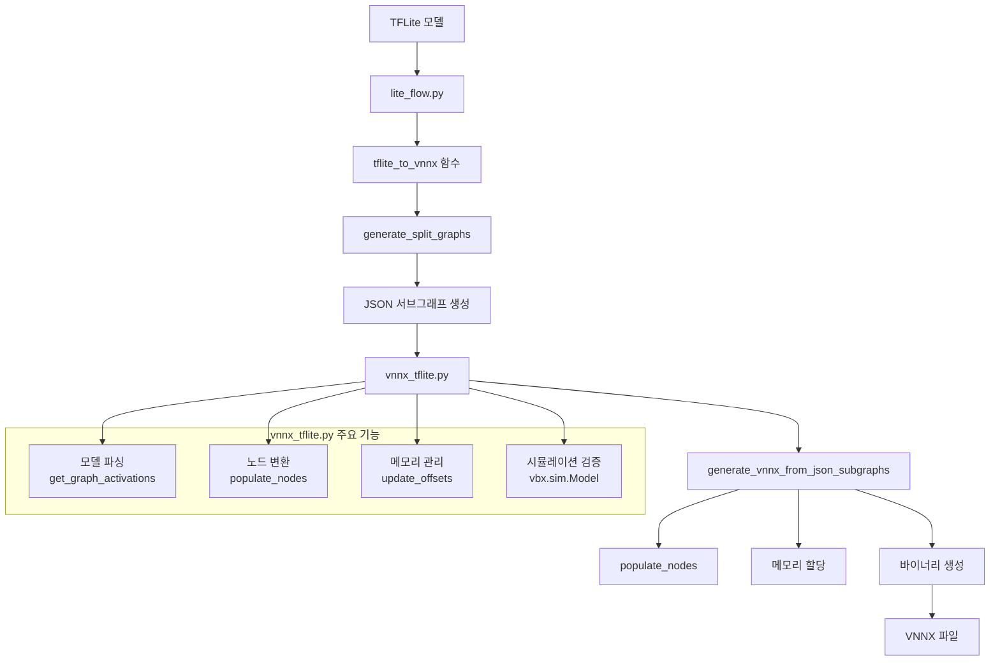

`vnnx_tflite.py`는 TensorFlow Lite  모델을 VectorBlox의 VNNX 형식으로 변환하는 핵심 모듈입니다.  

## 1. 전체 플로우 개요

먼저, TFLite → JSON 서브그래프 → VNNX 로 이어지는 전체 흐름을 간단한 다이어그램으로 정리할 수 있습니다.



위 플로우에서 `lite_flow.py`는 외부 API 역할을 하고, 실제 VNNX 바이너리 생성 로직은 대부분 `vnnx_tflite.py`에 구현되어 있습니다.

## 2. 주요 역할 정리

### 2.1 모델 변환 엔진: `generate_vnnx_from_json_subgraphs`

`generate_vnnx_from_json_subgraphs` 함수는 JSON 형태로 표현된 TFLite 서브그래프들을 입력으로 받아, 최종 VNNX 바이너리 바이트 스트림을 생성합니다.

- JSON 서브그래프 목록과 size configuration(V250/V500/V1000 등)을 받아서,
- 각 노드를 VNNX 내부 노드 포맷으로 변환하고,
- 텐서/서브노드/그래프 메타데이터를 모두 직렬화하여 하나의 바이너리(`data`)로 합칩니다.

이때, 내부적으로는 `Nodes` 리스트와 `vnnx_graph` 메타 객체를 유지하면서, 그래프 구조와 텐서 정보를 함께 관리합니다.

### 2.2 연산자 처리: TFLite → VNNX

`vnnx_tflite.py`는 다양한 TensorFlow Lite 연산자를 VNNX 내부 표현으로 매핑합니다.

- 예: `CONV_2D`, `DEPTHWISE_CONV_2D`, `MAX_POOL_2D`, `ADD`, `MUL`, `RELU`, `SOFTMAX` 등
- 각 연산자는 `Subnode` 구조체에 매핑되며, 커널 크기, stride, padding, activation 등 옵션이 세부적으로 저장됩니다.

예를 들어, `MAX_POOL_2D`의 경우 SAME padding일 때 필요한 경우 자동으로 `PAD` 서브노드를 앞에 삽입하여, TFLite의 padding 동작을 정확히 재현합니다.

```python
elif subcode == 'MAX_POOL_2D':
    sn.type = BuiltinOperator.MAX_POOL_2D
    sn.kernel_shape = [opts['filter_height'], opts['filter_width']]
    sn.strides = [opts['stride_h'], opts['stride_w']]
    ...
    if opts['padding'] == "SAME":
        # 입력/출력 크기와 stride, kernel을 바탕으로 pad 크기 계산 후
        # 필요하면 PAD 서브노드 삽입
        pad_sn = Subnode()
        pad_sn.type = BuiltinOperator.PAD
        ...
        subnode_array.append(pad_sn)
    subnode_array.append(sn)
```

이처럼, TFLite의 high-level 연산 의미를 VNNX 하드웨어 친화적인 형태로 재구성하는 것이 `populate_nodes` 계열 로직의 핵심입니다.

### 2.3 메모리 관리: `update_offsets`

VNNX는 하나의 큰 바이너리 안에 그래프/노드/서브노드/텐서/가중치/리플레이 버퍼를 모두 포함합니다.  
`update_offsets` 함수는 이 모든 구조체의 메모리 오프셋을 일관되게 재계산하는 역할을 합니다.

- 각 노드/서브노드/텐서의 배열 크기를 기반으로,  
  - `node_offset`, `subnode_offset`, `tensor_offset`, `weights_offset`를 순차적으로 할당
- `weights_offset`는 16바이트 정렬(align) 규칙을 만족하도록 조정
- `vnnx_graph`와 각 `Node`/`Subnode`/`Tensor`에 대해 `update_offsets`를 호출해 내부 버퍼 주소를 갱신
- 최종적으로 직렬화된 `node_data`, `subnode_data`, `tensor_data`와 정렬 패딩(`align`)을 반환합니다.

```python
def update_offsets(vnnx_graph, Nodes, weights_offset=None, min_addr=None):
    ...
    if weights_offset is None:
        weights_offset = tensor_offset + num_tensors*tensor_size
    # align weights_offset
    if weights_offset % 16 != 0:
        align_len = 16 - (weights_offset % 16)
        align = [bytearray(align_len)]
        weights_offset += align_len
    vnnx_graph.update_offsets(weights_offset, min_addr)
    for n in Nodes:
        n.update_offsets(weights_offset, min_addr)
    ...
    return node_data, subnode_data, tensor_data, align
```

이 과정 덕분에, VNNX 런타임은 고정된 오프셋 정보만으로 모든 텐서와 가중치 위치를 찾을 수 있습니다.

## 3. 정리 및 앞으로의 계획

- `vnnx_tflite.py`는:
  - TFLite 모델을 VNNX로 변환하는 모델 컴파일러의 핵심 구현체이고,
  - 연산자 매핑, 메모리 레이아웃 계산, 시뮬레이션 검증까지 모두 관장합니다.
- 현재 공개된 `vnnx_tflite.py`는 최신 AI 모델(예: 최신 YOLO/Segmentation/Transformer 계열)의 모든 패턴을 완전히 커버하지 못하는 한계가 있습니다.  
- 이를 해결하기 위해, 실제 SDK 내부 코드를 분석("리버싱")하여 최신 연산자 조합과 네트워크 패턴을 지원하도록 연산자 매핑 로직과 메모리 레이아웃을 개선하여, 최신 모델에서도 안정적으로 동작하도록 수정한 커스텀 버전을 작성했습니다.

---

**Language**: [English](/posts/2025/12/vectorblox-vnnx-tflite-internals-en/)


