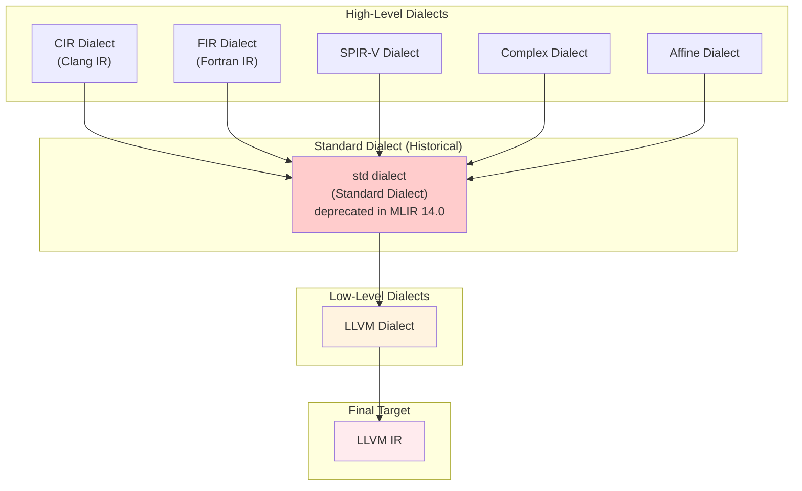
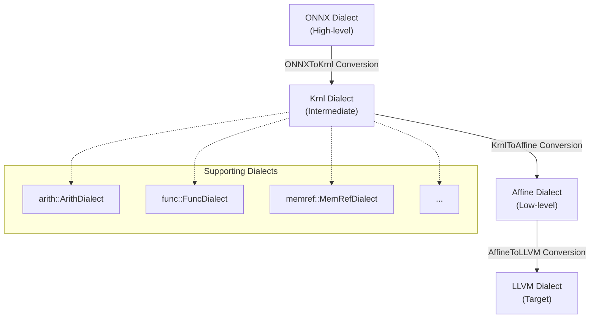

There are cases where the environment in which AI models are trained differs from the environment where inference is performed. That is, increasing model portability is an important goal.

onnx-mlir is an open-source compiler designed to solve this problem. It converts AI models written in the ONNX standard to native code for target hardware.

This post covers three key elements for understanding onnx-mlir: MLIR, ONNX, and onnx-mlir.

## 1. MLIR (Multi-Level Intermediate Representation)[^1]

Multi-Level IR: MLIR enables the design and implementation of code generators, transformers, and optimization tools at various levels of abstraction.

### Multi-Level Abstraction and Progressive Lowering

The core design principle of MLIR is to support Progressive Lowering. This allows the compiler pipeline to perform lowering in small steps along multiple abstraction levels, from high-level to low-level representations.

In MLIR, abstraction is managed through `Dialect`. The `Dialect` Diagram is shown below. (This is a diagram from when the paper was published, so it differs from the model currently in use.)

### MLIR Dialect Diagram



---

## 2. ONNX (Open Neural Network Exchange)[^2]

ONNX consists of computation graph models, data types, and operators. It provides a common language that all machine learning frameworks can use to describe models.

### Example

This is the IR format of the most basic linear regression model `Y = XA`.

```
<  
    ir_version: 8,  
    opset_import: [ "" : 15]  
>  
agraph (float[I,J] X, float[I] A, float[I] B) => (float[I] Y) {  
    XA = MatMul(X, A)  
    Y = Add(XA, B)  
}
```

The IR structure analysis is as follows:
- Model metadata
    - `ir_version`: ONNX IR version (currently 8)
    - `opset_import`: Version of the operator set to use
- Graph definition
    - `agraph`: Graph name
    - `float[I,J] X`: Input type and shape (float type, I×J dimensional X)
    - `=> (float[I] Y)`: Output type and shape
- Operation definition
    - `XA = MatMul(X, A)`: Matrix multiplication operation
    - `Y = Add(XA, B)`: Addition operation

---

## 3. onnx-mlir[^3]

onnx-mlir is a project that uses MLIR to compile ONNX models.

### onnx-mlir Dialect Levels



### Example

The Dialect Level transformation process of the Add operation in onnx-mlir is as follows.

- ONNX Dialect

```
func.func @add_example(%arg0: tensor<2x2xf32>, %arg1: tensor<2x2xf32>) -> tensor<2x2xf32> {  
  %0 = "onnx.Add"(%arg0, %arg1) : (tensor<2x2xf32>, tensor<2x2xf32>) -> tensor<2x2xf32>  
  return %0 : tensor<2x2xf32>  
}
```

- ONNX → Krnl: The ONNX Add operation is converted to a loop structure in the Krnl dialect.

```
func.func @add_example(%arg0: memref<2x2xf32>, %arg1: memref<2x2xf32>) -> memref<2x2xf32> {  
  %res = memref.alloc() : memref<2x2xf32>  
  %loop = krnl.define_loops 2  
  krnl.iterate(%loop#0, %loop#1) with (%loop#0 -> %i = 0 to 2, %loop#1 -> %j = 0 to 2) {  
    %v0 = krnl.load %arg0[%i, %j] : memref<2x2xf32>  
    %v1 = krnl.load %arg1[%i, %j] : memref<2x2xf32>  
    %add = arith.addf %v0, %v1 : f32  
    krnl.store %add, %res[%i, %j] : memref<2x2xf32>  
  }  
  return %res : memref<2x2xf32>  
}
```

- Krnl → Affine: Krnl loops are converted to the Affine dialect.

```
func.func @add_example(%arg0: memref<2x2xf32>, %arg1: memref<2x2xf32>) -> memref<2x2xf32> {  
  %res = memref.alloc() : memref<2x2xf32>  
  affine.for %i = 0 to 2 {  
    affine.for %j = 0 to 2 {  
      %v0 = affine.load %arg0[%i, %j] : memref<2x2xf32>  
      %v1 = affine.load %arg1[%i, %j] : memref<2x2xf32>  
      %add = arith.addf %v0, %v1 : f32  
      affine.store %add, %res[%i, %j] : memref<2x2xf32>  
    }  
  }  
  return %res : memref<2x2xf32>  
}
```

- Final LLVM Dialect: The Affine dialect is converted to LLVM IR, generating actual executable code.

---

Language: [한국어 (Korean)](/posts/2025/12/onnx-mlir-compiler-infrastructure/)

[^1]: [Chris Lattner et al., "MLIR: A Compiler Infrastructure for the End of Moore's Law", 2021 IEEE/ACM International Symposium on Code Generation and Optimization (CGO),Seoul, Korea (South)](https://ieeexplore.ieee.org/abstract/document/9370308)
[^2]: https://github.com/onnx/onnx
[^3]: [Jin, Tian, et al. "Compiling onnx neural network models using mlir." arXiv preprint arXiv:2008.08272 (2020)](https://arxiv.org/pdf/2008.08272)