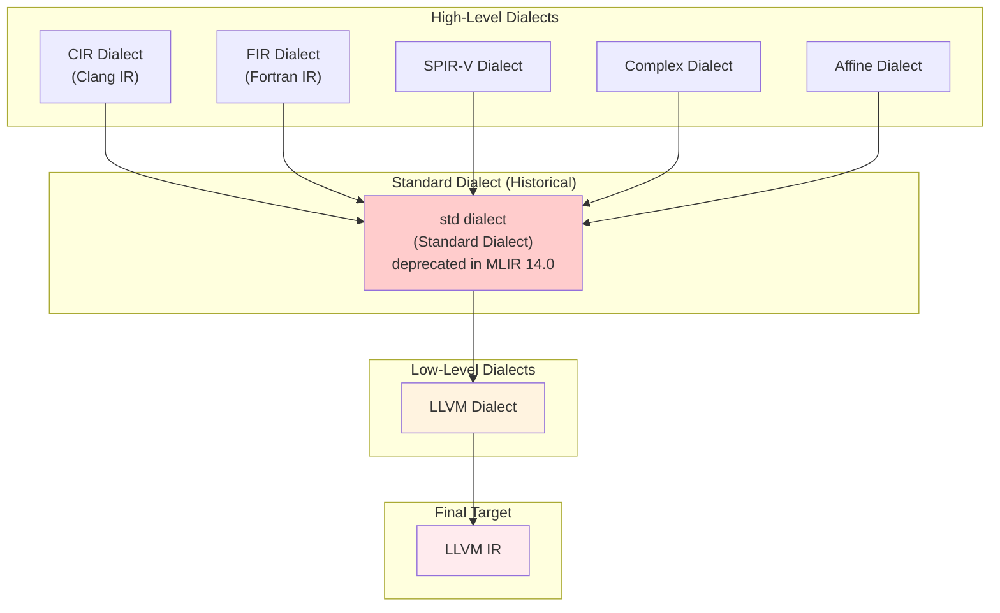
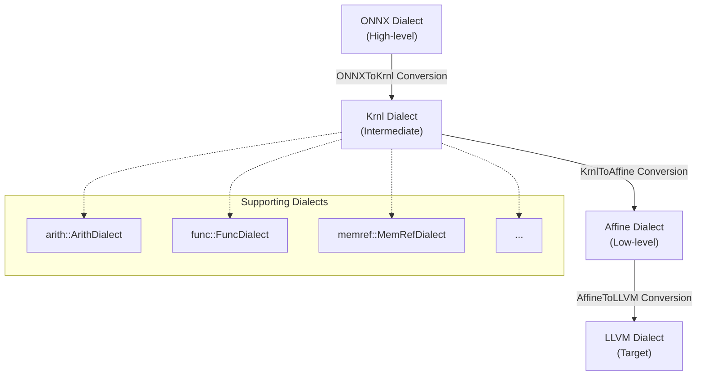

AI 모델을 훈련시킨 환경과 추론을 수행하는 환경이 다른 경우가 존재합니다.  즉, 모델의 이식성을 늘리는 것이 중요한 목표입니다.

onnx-mlir은 이러한 문제를 해결하기 위해 설계된 오픈 소스 컴파일러입니다. 이는 ONNX 표준으로 작성된 AI 모델을 목표 하드웨어의 네이티브 코드로 변환하게 해줍니다.

포스트에서는 onnx-mlir을 이해하기 위한 세 가지 핵심 요소인 MLIR, ONNX, 그리고 onnx-mlir에 대해 다룹니다.

## 1. MLIR (Multi-Level Intermediate Representation)

Multi-Level IR: MLIR은 코드 생성기, 변환기, 최적화 도구의 설계 및 구현을 다양한 추상화 수준에서 할 수 있게 해줍니다.

### Multi-Level Abstraction 및 Progressive Lowering

MLIR의 핵심 설계 원칙은 점진적 하향 변환(Progressive Lowering)을 지원하는 것입니다. 이는 고수준에서부터 저수준까지, 여러 추상화 레벨을 따라 컴파일러 파이프라인에서 하향 변환을 수행할 수 있도록 합니다.

MLIR에서 추상화는 `Dialect`를 통해 관리됩니다. `Dialect` Diagram은 아래와 같습니다. (논문이 나온 시점의 Diagram이므로, 현재 사용하는 모델과는 차이가 있습니다.)

### MLIR Dialect Diagram



---

## 2. ONNX (Open Neural Network Exchange)

ONNX는 계산 그래프 모델, 데이터 타입, 연산자로 구성되어 있습니다. 모든 머신러닝 프레임워크가 모델을 설명하는 데 사용할 수 있는 공통 언어를 제공하는 것입니다.

### Example
가장 기본적인 선형 회귀 모델 ```Y =  XA```의 IR 형식입니다.

```
<  
    ir_version: 8,  
    opset_import: [ "" : 15]  
>  
agraph (float[I,J] X, float[I] A, float[I] B) => (float[I] Y) {  
    XA = MatMul(X, A)  
    Y = Add(XA, B)  
}
```

IR 구조 분석은 다음과 같습니다.
- 모델 메타 데이터
    - `ir_version`: ONNX IR 버전 (현재 8)
    - `opset_import`: 사용할 연산자 세트 버전
- 그래프 정의
    - `agraph`: 그래프 이름
    - `float[I,J] X`: 입력 타입과 형태 (float 타입, I×J 차원의 X)
    - `=> (float[I] Y)`: 출력 타입과 형태
- 연산 정의
    - `XA = MatMul(X, A)`: 행렬 곱셈 연산
    - `Y = Add(XA, B)`: 덧셈 연산

---

## 3. onnx-mlir

onnx-mlir는 ONNX 모델을 컴파일하기 위해 MLIR를 활용하는 프로젝트입니다.

### onnx-mlir Dialect Levels



### Example

Add 연산의 onnx-mlir의 Dialect Level 변환 과정은 다음과 같습니다.

- ONNX Dialect

```
func.func @add_example(%arg0: tensor<2x2xf32>, %arg1: tensor<2x2xf32>) -> tensor<2x2xf32> {  
  %0 = "onnx.Add"(%arg0, %arg1) : (tensor<2x2xf32>, tensor<2x2xf32>) -> tensor<2x2xf32>  
  return %0 : tensor<2x2xf32>  
}
```

- ONNX → Krnl: ONNX Add 연산이 Krnl dialect의 loop 구조로 변환됩니다.

```
func.func @add_example(%arg0: memref<2x2xf32>, %arg1: memref<2x2xf32>) -> memref<2x2xf32> {  
  %res = memref.alloc() : memref<2x2xf32>  
  %loop = krnl.define_loops 2  
  krnl.iterate(%loop#0, %loop#1) with (%loop#0 -> %i = 0 to 2, %loop#1 -> %j = 0 to 2) {  
    %v0 = krnl.load %arg0[%i, %j] : memref<2x2xf32>  
    %v1 = krnl.load %arg1[%i, %j] : memref<2x2xf32>  
    %add = arith.addf %v0, %v1 : f32  
    krnl.store %add, %res[%i, %j] : memref<2x2xf32>  
  }  
  return %res : memref<2x2xf32>  
}
```

- Krnl → Affine: Krnl loop이 Affine dialect로 변환됩니다.

```
func.func @add_example(%arg0: memref<2x2xf32>, %arg1: memref<2x2xf32>) -> memref<2x2xf32> {  
  %res = memref.alloc() : memref<2x2xf32>  
  affine.for %i = 0 to 2 {  
    affine.for %j = 0 to 2 {  
      %v0 = affine.load %arg0[%i, %j] : memref<2x2xf32>  
      %v1 = affine.load %arg1[%i, %j] : memref<2x2xf32>  
      %add = arith.addf %v0, %v1 : f32  
      affine.store %add, %res[%i, %j] : memref<2x2xf32>  
    }  
  }  
  return %res : memref<2x2xf32>  
}
```

- 최종 LLVM Dialect: Affine dialect가 LLVM IR로 변환되어 실제 실행 코드가 생성됩니다.

---

Language: [English](/posts/2025/12/onnx-mlir-compiler-infrastructure-en/)

