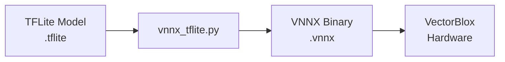

## Role of vnnx_tflite.py

In the VectorBlox SDK compilation pipeline, `vnnx_tflite.py` plays a key role:

- Converts TFLite operators (TRANSPOSE, RESHAPE, etc.) to VectorBlox hardware instructions
- Serializes parameters using C structures (`struct.pack`)
- Reflects hardware constraints (only 4D tensors supported, specific pattern limitations)



## Problem 1: TRANSPOSE Operation

### Compilation Failure Log

The following error occurred during SPNv2 model compilation:

```
File "vnnx_tflite2.py", line 5033
assert(np.all([_ == i for i,_ in enumerate(lead_axes)]))
AssertionError

# SPNv2 model compilation failed
```

### Root Cause

This problem was caused by optimization during the TFLite conversion process.

What the SPNv2 model actually intended was a very simple flatten operation. It tried to convert a 5-dimensional tensor `[1, 4, 4, 9, 4]` generated from the detection head to a 3-dimensional `[1, 144, 4]`. Here, `4×4×9=144`, and the goal was to merge the middle three dimensions (height, width, anchor) into a single position dimension.

However, what the TFLite converter actually did was different from expectations. TFLite decomposed this simple reshape operation into a combination of TRANSPOSE and RESHAPE to optimize memory access patterns. Specifically, it first performed `TRANSPOSE(perm=[0, 4, 1, 2, 3])` to move the keypoint dimension forward, then reshaped it. (This is to create a cache-friendly memory layout.)

When the VectorBlox SDK tried to process this, a problem occurred. When the SDK receives a TRANSPOSE operation, it extracts `lead_axes=[0, 4]` from `transform=[0, 4, 1, 2, 3]` (excluding the last three). It then verifies whether these axes are consecutive (must be in the form `[0, 1, 2, ...]`). However, `[0, 4]` is not consecutive (4 comes after 0, not 1). This is a signal that it's not an actual TRANSPOSE but a mis-converted RESHAPE. The SDK failed to recognize this and failed the verification, raising an AssertionError.

In conclusion, this error was a compatibility issue caused by TFLite's optimization not matching the VectorBlox SDK.

### Solution Process

To solve the problem, we needed to detect TRANSPOSE operations that TFLite incorrectly converted and restore them to the original RESHAPE.

The code before modification simply verified whether `lead_axes` was consecutive and immediately raised an error if not.

```python
elif subcode == 'TRANSPOSE':
    transform = get_numpy_data_from_index(...)
    lead_axes = transform[:-3]
    
    # Only perform consecutive verification
    assert(np.all([_ == i for i,_ in enumerate(lead_axes)]))
    # Compilation error if non-consecutive
```

After modification, we added logic to detect two patterns before the assert.

The first is when transform is very short or in a simple form (`[1, x, y]`). This indicates a simple flatten, so we process it as RESHAPE.

The second is when `lead_axes` is non-consecutive. When such cases are detected, we change the operation type back to RESHAPE and set the `nop=1` flag. The `nop=1` flag can be set when the memory access pattern is identical and only the shape metadata needs to be changed, passing only pointers without actual hardware operations.

```python
elif subcode == 'TRANSPOSE':
    transform = get_numpy_data_from_index(...)
    
    # Pattern 1: Simple flatten detection
    if len(transform) <= 2 or (len(transform) == 3 and transform[0] == 1):
        sn.type = BuiltinOperator.RESHAPE
        sn.ReshapeOptions.mode = 0
        sn.nop = 1
    
    # Pattern 2: Non-consecutive lead_axes detection
    else:
        lead_axes = transform[:-3]
        if len(lead_axes) > 0 and not np.all([_ == i for i,_ in enumerate(lead_axes)]):
            # Detect mis-conversion and restore to RESHAPE
            sn.type = BuiltinOperator.RESHAPE
            sn.ReshapeOptions.mode = 0
            sn.nop = 1
        else:
            # Actual TRANSPOSE → existing logic
            [existing TRANSPOSE processing]
```

### Solution Result

After modification, compilation proceeds successfully:

```
[TRANSPOSE transform=[0,4,1,2,3]]
DBG: Non-consecutive lead_axes detected → Convert to RESHAPE
[RESHAPE NOP processing]
Compilation successful
```

This modification enables automatic detection of TRANSPOSE operations that were incorrectly converted due to TFLite optimization and restoration to the original RESHAPE operations.

---

**Series Posts**

- Next: [Problem 2 - RESHAPE Operation](/posts/2025/12/vectorblox-vnnx-tflite-reshape-fix-en/)

**Language**: [한국어 (Korean)](/posts/2025/12/vectorblox-vnnx-tflite-transpose-fix/)

