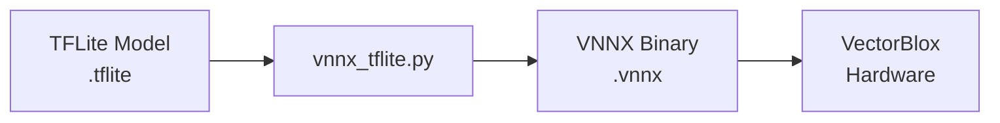

## vnnx_tflite.py의 역할

VectorBlox SDK 컴파일 파이프라인에서 `vnnx_tflite.py`는 핵심 역할을 수행합니다:

- TFLite 연산자(TRANSPOSE, RESHAPE 등)를 VectorBlox 하드웨어 명령어로 변환
- C 구조체(`struct.pack`)로 파라미터 직렬화
- 하드웨어 제약 반영 (4D 텐서만 지원, 특정 패턴 제한)



## 문제 1: TRANSPOSE 연산

### 컴파일 실패 로그

SPNv2 모델 컴파일 중 다음과 같은 에러가 발생했습니다:

```
File "vnnx_tflite2.py", line 5033
assert(np.all([_ == i for i,_ in enumerate(lead_axes)]))
AssertionError

# SPNv2 모델 컴파일 실패
```

### 문제 원인

이 문제는 TFLite 변환 과정에서 발생한 최적화 때문입니다.

SPNv2 모델이 실제로 하려던 것은 매우 단순한 flatten 연산이었습니다. Detection head에서 생성된 5차원 텐서 `[1, 4, 4, 9, 4]`를 3차원 `[1, 144, 4]`로 변환하려고 했습니다. 여기서 `4×4×9=144`로, 중간 3개 차원(높이, 너비, 앵커)을 하나의 위치 차원으로 합치는 것이 목적이었습니다.

하지만, TFLite 변환기가 실제로 한 일은 예상과 달랐습니다. TFLite는 메모리 접근 패턴을 최적화하기 위해 이 단순한 reshape 연산을 TRANSPOSE와 RESHAPE의 조합으로 분해했습니다. 구체적으로 `TRANSPOSE(perm=[0, 4, 1, 2, 3])`를 먼저 수행하여 키포인트 차원을 앞으로 옮긴 후, 다시 reshape하는 방식으로 변환했습니다. (이는 캐시 친화적인 메모리 배치를 만들기 위한 것입니다.)

VectorBlox SDK가 이를 처리하려 할 때 문제가 발생했습니다. SDK는 TRANSPOSE 연산을 받으면 `transform=[0, 4, 1, 2, 3]`에서 마지막 3개를 제외한 앞부분인 `lead_axes=[0, 4]`를 추출합니다. 그런 다음 이 축들이 연속적인지 검증합니다(`[0, 1, 2, ...]` 형태여야 함). 하지만 `[0, 4]`는 연속적이지 않습니다(0 다음에 1이 아닌 4가 옴). 이는 실제 TRANSPOSE가 아니라 잘못 변환된 RESHAPE라는 신호입니다. SDK는 이를 인식하지 못하고 검증에서 실패하여 AssertionError를 발생시켰습니다.

결론적으로, 이 에러는 TFLite의 최적화가 VectorBlox SDK와 맞지 않아 발생한 호환성 문제입니다.

### 해결 과정

문제를 해결하기 위해서는 TFLite가 잘못 변환한 TRANSPOSE를 감지하여 원래의 RESHAPE로 되돌려야 했습니다.

수정 전 코드는 단순히 `lead_axes`가 연속적인지 검증하고, 아니면 즉시 에러를 발생시켰습니다.

```python
elif subcode == 'TRANSPOSE':
    transform = get_numpy_data_from_index(...)
    lead_axes = transform[:-3]
    
    # 연속성 검증만 수행
    assert(np.all([_ == i for i,_ in enumerate(lead_axes)]))
    # 비연속이면 컴파일 에러 발생
```

수정 후에는 assert 전에 두 가지 패턴을 감지하는 로직을 추가했습니다.

첫 번째는 transform이 매우 짧거나 단순한 형태(`[1, x, y]`)인 경우입니다. 이는 단순 flatten을 의미하므로 RESHAPE로 처리합니다.

두 번째는 `lead_axes`가 비연속적인 경우입니다. 이런 경우를 감지하면 연산 타입을 다시 RESHAPE로 변경하고, `nop=1` 플래그를 설정하도록 수정했습니다. `nop=1` 플래그를 설정할 수 있는 경우는, 메모리 접근 패턴이 동일하여 shape 메타데이터만 변경하면 되는 경우로, 실제 하드웨어 연산 없이 포인터만 전달합니다.

```python
elif subcode == 'TRANSPOSE':
    transform = get_numpy_data_from_index(...)
    
    # 패턴 1: 단순 flatten 감지
    if len(transform) <= 2 or (len(transform) == 3 and transform[0] == 1):
        sn.type = BuiltinOperator.RESHAPE
        sn.ReshapeOptions.mode = 0
        sn.nop = 1
    
    # 패턴 2: 비연속 lead_axes 감지
    else:
        lead_axes = transform[:-3]
        if len(lead_axes) > 0 and not np.all([_ == i for i,_ in enumerate(lead_axes)]):
            # 오변환 감지하여, RESHAPE로 복구
            sn.type = BuiltinOperator.RESHAPE
            sn.ReshapeOptions.mode = 0
            sn.nop = 1
        else:
            # 실제 TRANSPOSE → 기존 로직
            [기존 TRANSPOSE 처리]
```

### 해결 결과

수정 후 컴파일이 성공적으로 진행됩니다.

```
[TRANSPOSE transform=[0,4,1,2,3]]
DBG: Non-consecutive lead_axes detected → RESHAPE로 변환
[RESHAPE NOP 처리]
컴파일 성공
```

이 수정을 통해 TFLite의 최적화로 인해 잘못 변환된 TRANSPOSE 연산을 자동으로 감지하고 원래의 RESHAPE 연산으로 복구할 수 있게 되었습니다.

---

**시리즈 포스트**

- 다음: [문제 2 - RESHAPE 연산](/posts/2025/12/vectorblox-vnnx-tflite-reshape-fix/)

**Language**: [English](/posts/2025/12/vectorblox-vnnx-tflite-transpose-fix-en/)
