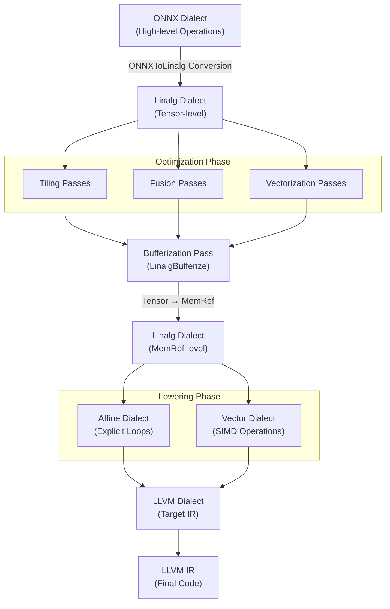

## 1. Problem of current ONNX-MLIR Compilation Flow

$$\text{ONNX} \xrightarrow{Lowering} \text{Krnl} \xrightarrow{Lowering} \text{Affine}\xrightarrow{Lowering} \text{LLVM IR}$$

To apply sophisticated optimizations specialized for matrix operations (Tiling, Fusion), complex manual passes must be written at the Krnl level.

---

## 2. Linalg Dialect

Linalg operations have defined structures such as `linalg.matmul`, `linalg.conv_2d_nhwc_hwcf`, etc.
Linalg's design is engineered to easily apply the following transformations:

- Parametric Tiling: Divides large operations into smaller blocks (tiles) considering the memory hierarchy (cache).
- Tiled Fusion: Fuses producer-consumer operations within tile boundaries to keep intermediate data in cache, reducing memory overhead.
- Promotion to Temporary Buffer: Moves data from slow memory to fast temporary buffers (scratchpad memory) to optimize data access speed.
- Vectorization: Converts Linalg operations to vector Dialect to facilitate SIMD instruction (AVX, NEON) utilization.

By replacing Krnl Dialect with Linalg Dialect, we can take advantage of Linalg's benefits.

$$\text{ONNX} \xrightarrow{Lowering} \text{Linalg} \xrightarrow{\text{Tiling/Bufferization/Vectorization}} \text{...}$$

---

## 3. Linalg Dialect-Based Compilation Pipeline

The final target pipeline is as follows:

---

Language: [한국어 (Korean)](/posts/2025/12/onnx-mlir-linalg-dialect/)

