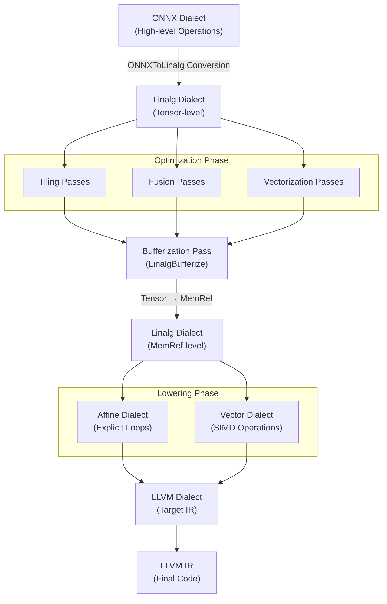

## 1. 현재 ONNX-MLIR의 컴파일 흐름의 문제

$$\text{ONNX} \xrightarrow{Lowering} \text{Krnl} \xrightarrow{Lowering} \text{Affine}\xrightarrow{Lowering} \text{LLVM IR}$$

행렬 연산에 특화된 정교한 최적화(Tiling, Fusion)를 적용하기 위해서는, Krnl 레벨에서 복잡한 수동 패스를 작성해야 합니다. 

---

## 2. Linalg Dialect 

Linalg Dialect는 다음과 같은 Transformations를 쉽게 적용할 수 있도록 고안되었습니다.

- Parametric Tiling: 메모리 계층 구조(캐시)를 고려하여 대형 연산을 작은 블록(타일)으로 나누어 처리합니다. 
- Tiled Fusion: 타일 경계 내에서 생산자-소비자 연산을 융합하여 중간 데이터를 캐시에 유지함으로써 메모리 오버헤드를 줄입니다.
- Promotion to Temporary Buffer: 데이터를 느린 메모리에서 빠른 임시 버퍼(스크래치패드 메모리)로 이동시켜 데이터 접근 속도를 최적화합니다.
- Vectorization: Linalg 연산을 vector Dialect로 변환하여 SIMD 명령어(AVX, NEON) 활용을 용이하게 합니다.

Krnl Dialect 대신, Linalg Dialect로 대체하면 Linalg의 이점을 취할 수 있습니다.

$$\text{ONNX} \xrightarrow{Lowering} \text{Linalg} \xrightarrow{\text{Tiling/Bufferization/Vectorization}} \text{...}$$

---

## 3. Linalg Dialect 기반 컴파일 파이프라인

최종적으로 목표하고자 하는 파이프라인은 다음과 같습니다.

---

**시리즈 포스트**

- 이전: [onnx-mlir란 무엇인가?](/posts/2025/12/onnx-mlir-compiler-infrastructure/)
- 다음: [ONNXToLinalg 파이프라인 구축: MatMul 연산 변환 구현](/posts/2025/12/onnx-mlir-onnx-to-linalg-pipeline/)

**Language**: [English](/posts/2025/12/onnx-mlir-linalg-dialect-en/)

