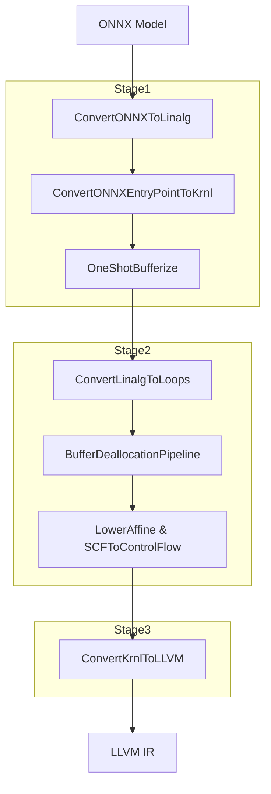

When using the `--use-linalg-path` option, a 3-stage pipeline is executed that passes through MLIR standard dialects instead of the traditional Krnl-centric path. This post covers the detailed content of each stage and the End-to-End validation method.

---

## 1. Pipeline with useLinalgPath Enabled



### [Stage 1] ONNX to Linalg & Bufferization (addONNXToLinalgPasses)

This stage converts high-level ONNX operations to Linalg operations and transforms "Tensor" into "MemRef", which represents actual physical memory.

#### ConvertONNXToLinalg

Converts ONNX operations to high-level structured operations such as `linalg.generic` or specific linalg operations (e.g., `linalg.matmul`).

#### ConvertONNXEntryPointToKrnl

Converts `onnx.EntryPoint` to `krnl.EntryPoint` to connect with the existing runtime interface.

#### OneShotBufferize

Applies MLIR's latest bufferization technology.

```cpp
bufferization::OneShotBufferizePassOptions bufferizeOptions;
bufferizeOptions.bufferizeFunctionBoundaries = true; // Convert function arguments (Tensor) to MemRef
pm.addPass(bufferization::createOneShotBufferizePass(bufferizeOptions));
```

### [Stage 2] Linalg to Affine/SCF & Buffer Management (addLinalgToAffinePasses)

Unrolls operations with allocated memory addresses into loop structures and manages memory lifecycle.

#### ConvertLinalgToLoops

Converts `linalg` operations to loops in the form of `affine.for` or `scf.for`.

#### BufferDeallocationPipeline

Prevents memory leaks.

```cpp
funcPM.addPass(bufferization::createBufferLoopHoistingPass()); // Move allocation code outside loops
mlir::bufferization::buildBufferDeallocationPipeline(funcPM, options); // Insert dealloc at appropriate locations
```

#### LowerAffine & SCFToControlFlow

Converts loop structures to the lowest-level control flow (CFG).

### [Stage 3] LLVM Dialect Conversion (addLinalgToLLVMPasses)

This stage converts to LLVM IR.

#### ConvertKrnlToLLVM

Processes the `krnl.EntryPoint` created in [Stage 1] to generate runtime API functions such as `omQueryEntryPoints` and `omInputSignature` that allow external calls to the model.

---

## 2. Validation

A driver code was included to validate that the calculations are accurate down to actual numerical computation.

### Dynamic Library Loading and Function Mapping

Loads the compiled dynamic library `.so` file and retrieves function addresses.

```cpp
// 1. Load compiled model library
void* handle = dlopen("./test_linalg.onnx.so", RTLD_LAZY);

// 2. Get model information query function
typedef const char** (*QueryEntryPointsFunc)(int64_t*);
QueryEntryPointsFunc queryEntryPoints = (QueryEntryPointsFunc)dlsym(handle, "omQueryEntryPoints");

// 3. Find address of actual inference function (run_main_graph)
typedef OMTensorList* (*RunFunc)(OMTensorList*);
RunFunc runFunc = (RunFunc)dlsym(handle, "run_main_graph");
```

### Test Input Data Construction

```cpp
// Input A (2x3): {1, 2, 3, 4, 5, 6}
int64_t shapeA[] = {2, 3};
float x1Data[] = {1.0, 2.0, 3.0, 4.0, 5.0, 6.0};
OMTensor *x1 = omTensorCreate(x1Data, shapeA, 2, ONNX_TYPE_FLOAT);

// Input B (3x4): {1, 2, 3, 4, 5, 6, 7, 8, 9, 10, 11, 12}
int64_t shapeB[] = {3, 4};
float x2Data[] = {1.0, 2.0, 3.0, 4.0, 5.0, 6.0, 7.0, 8.0, 9.0, 10.0, 11.0, 12.0};
OMTensor *x2 = omTensorCreate(x2Data, shapeB, 2, ONNX_TYPE_FLOAT);

OMTensor *list[] = {x1, x2};
OMTensorList *input = omTensorListCreate(list, 2);
```

### Driver Execution

Compares the inference result `outputData` with pre-calculated expected values.

```cpp
OMTensorList *output = runFunc(input);
OMTensor *y = omTensorListGetOmtByIndex(output, 0);
float *outputData = (float*)omTensorGetDataPtr(y);

// Expected result (MatMul result)
// Row 0: 38, 44, 50, 56
// Row 1: 83, 98, 113, 128
std::cout << "Actual output:" << std::endl;
for (int i = 0; i < 2; i++) {
    for (int j = 0; j < 4; j++) {
        std::cout << outputData[i * 4 + j] << " "; // Check actual output values
    }
}
```

---

**Series Posts**

- Previous: [ONNXToLinalg Pipeline Construction: MatMul Operation Conversion Implementation](/posts/2025/12/onnx-mlir-onnx-to-linalg-pipeline-en/)

**Language**: [한국어](/posts/2026/01/onnx-mlir-linalg-path-pipeline/)

