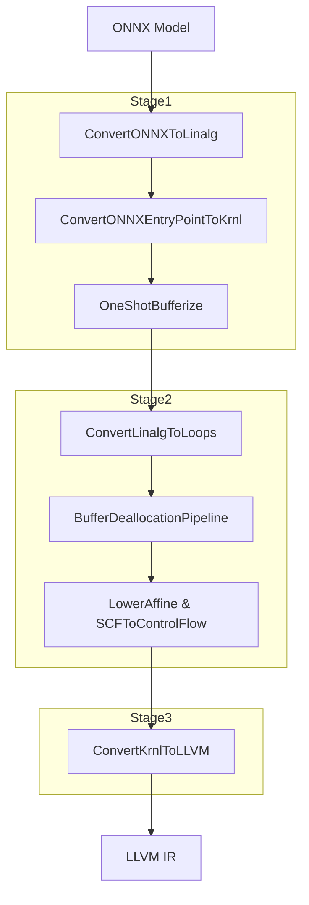

`--use-linalg-path` 옵션을 사용하면 기존의 Krnl 중심 경로 대신, MLIR 표준 다이얼렉트를 경유하는 3단계 파이프라인이 실행됩니다. 이 포스트에서는 각 단계의 상세 내용과 End-to-End 검증 방법을 다룹니다.

---

## 1. useLinalgPath 활성화 시 파이프라인



### [Stage 1] ONNX to Linalg & Bufferization (addONNXToLinalgPasses)

이 단계는 고수준 ONNX 연산을 Linalg 연산으로 바꾸고, "Tensor"를 실제 물리적 메모리인 "MemRef"로 변환합니다.

#### ConvertONNXToLinalg

ONNX 연산을 고수준 구조화 연산인 `linalg.generic` 또는 특정 linalg 연산(예: `linalg.matmul`)으로 변환합니다.

#### ConvertONNXEntryPointToKrnl

`onnx.EntryPoint`를 `krnl.EntryPoint`로 변환하여 기존 런타임 인터페이스와 연결합니다.

#### OneShotBufferize

MLIR의 최신 버퍼화 기술을 적용합니다.

```cpp
bufferization::OneShotBufferizePassOptions bufferizeOptions;
bufferizeOptions.bufferizeFunctionBoundaries = true; // 함수 인자(Tensor)를 MemRef로 변환
pm.addPass(bufferization::createOneShotBufferizePass(bufferizeOptions));
```

### [Stage 2] Linalg to Affine/SCF & Buffer Management (addLinalgToAffinePasses)

메모리 주소가 할당된 연산들을 루프 구조로 풀고, 메모리 생명주기를 관리합니다.

#### ConvertLinalgToLoops

`linalg` 연산을 `affine.for` 또는 `scf.for` 형태의 루프로 변환합니다.

#### BufferDeallocationPipeline

메모리 누수를 방지합니다.

```cpp
funcPM.addPass(bufferization::createBufferLoopHoistingPass()); // 루프 밖으로 할당 코드 이동
mlir::bufferization::buildBufferDeallocationPipeline(funcPM, options); // 적절한 위치에 dealloc 삽입
```

#### LowerAffine & SCFToControlFlow

루프 구조를 가장 낮은 수준의 제어 흐름(CFG)으로 변환합니다.

### [Stage 3] LLVM Dialect 변환 (addLinalgToLLVMPasses)

LLVM IR로 변환하는 단계입니다.

#### ConvertKrnlToLLVM

[Stage 1]에서 생성한 `krnl.EntryPoint`를 처리하여, 외부에서 모델을 호출할 수 있는 `omQueryEntryPoints`, `omInputSignature` 등의 런타임 API 함수들을 생성합니다.

---

## 2. 검증

실제 수치 계산까지 정확한지 검증하기 위해 드라이버 코드를 포함했습니다.

### 동적 라이브러리 로드 및 함수 매핑

컴파일된 동적 라이브러리 `.so` 파일을 로드하고, 함수 주소를 가져옵니다.

```cpp
// 1. 컴파일된 모델 라이브러리 로드
void* handle = dlopen("./test_linalg.onnx.so", RTLD_LAZY);

// 2. 모델 정보 조회 함수 가져오기
typedef const char** (*QueryEntryPointsFunc)(int64_t*);
QueryEntryPointsFunc queryEntryPoints = (QueryEntryPointsFunc)dlsym(handle, "omQueryEntryPoints");

// 3. 실제 추론 함수(run_main_graph) 주소 찾기
typedef OMTensorList* (*RunFunc)(OMTensorList*);
RunFunc runFunc = (RunFunc)dlsym(handle, "run_main_graph");
```

### 테스트용 입력 데이터 구성

```cpp
// Input A (2x3): {1, 2, 3, 4, 5, 6}
int64_t shapeA[] = {2, 3};
float x1Data[] = {1.0, 2.0, 3.0, 4.0, 5.0, 6.0};
OMTensor *x1 = omTensorCreate(x1Data, shapeA, 2, ONNX_TYPE_FLOAT);

// Input B (3x4): {1, 2, 3, 4, 5, 6, 7, 8, 9, 10, 11, 12}
int64_t shapeB[] = {3, 4};
float x2Data[] = {1.0, 2.0, 3.0, 4.0, 5.0, 6.0, 7.0, 8.0, 9.0, 10.0, 11.0, 12.0};
OMTensor *x2 = omTensorCreate(x2Data, shapeB, 2, ONNX_TYPE_FLOAT);

OMTensor *list[] = {x1, x2};
OMTensorList *input = omTensorListCreate(list, 2);
```

### 드라이버 실행

추론 결과물인 `outputData`를 사전에 계산된 기대값과 비교합니다.

```cpp
OMTensorList *output = runFunc(input);
OMTensor *y = omTensorListGetOmtByIndex(output, 0);
float *outputData = (float*)omTensorGetDataPtr(y);

// 예상 결과 (MatMul 결과값)
// Row 0: 38, 44, 50, 56
// Row 1: 83, 98, 113, 128
std::cout << "Actual output:" << std::endl;
for (int i = 0; i < 2; i++) {
    for (int j = 0; j < 4; j++) {
        std::cout << outputData[i * 4 + j] << " "; // 실제 출력값 확인
    }
}
```

---

**시리즈 포스트**

- 이전: [ONNXToLinalg 파이프라인 구축: MatMul 연산 변환 구현](/posts/2025/12/onnx-mlir-onnx-to-linalg-pipeline/)
- 다음: [Mixed Linalg and ONNX Operations를 위한 Bufferization](/posts/2026/01/onnx-mlir-bufferization-mixed-linalg-onnx/)

**Language**: [English](/posts/2026/01/onnx-mlir-linalg-path-pipeline-en/)

