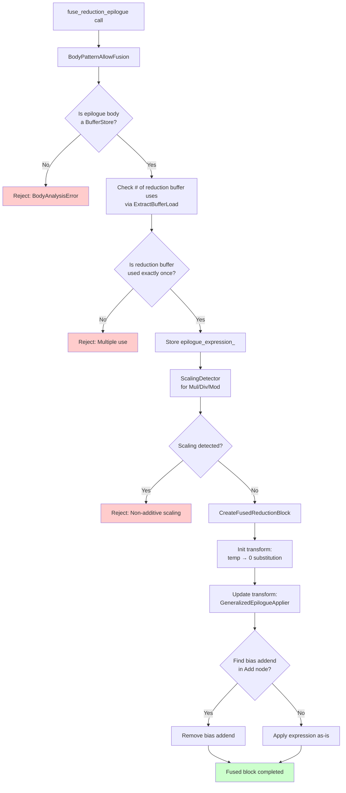

## Overview

The previous implementation of `fuseReductionEpilogue` relied on explicit pattern matching. Each epilogue type (Bias, BiasReLU, Clipping) required its own dedicated code path. While this worked functionally, it had several limitations: adding a new activation function required touching the core logic, and every new pattern needed explicit handling code.

We generalized `fuse_reduction_epilogue` so that it can handle arbitrary epilogue expressions without explicit pattern matching.

## Pattern-Matching-Based Design

In the pattern-matching-based design, we used an `EpilogueType` enum and analyzed patterns case by case.

```cpp
enum class EpilogueType { Bias, BiasReLU, Clipping };

bool AnalyzeEpiloguePattern(const PrimExpr& value) {
  if (const auto* add = value.as<AddNode>()) {
    // Detect Bias pattern: temp + C
    return EpilogueType::Bias;
  }
  if (const auto* max_node = value.as<MaxNode>()) {
    // Detect BiasReLU pattern: max(temp + C, 0)
    return EpilogueType::BiasReLU;
  }
  // ... more pattern-matching cases
}
```

This led to code like the following:

```cpp
if (epilogue_type_ == EpilogueType::Bias) {
  // Bias-specific handling
} else if (epilogue_type_ == EpilogueType::BiasReLU) {
  // BiasReLU-specific handling
} else {
  // Clipping-specific handling
}
```

## Expression-Based Generalization

Epilogue fusion follows a consistent mathematical structure.

In the `Init` transformation, we replace the reduction buffer load with the identity element (0 for addition). In the `Update` transformation, we replace the reduction buffer load with the reduction update expression, while properly handling the addend.

The target flow is as follows:



### 0. Terminology


### 1. Storing the Full Expression

**Before:**

```cpp
EpilogueType epilogue_type_;
PrimExpr epilogue_addend_;  // Bias-only
PrimExpr clipping_lower_;   // Clipping-only
PrimExpr clipping_upper_;   // Clipping-only
```

**After:**

```cpp
PrimExpr epilogue_expression_;  // Full expression: temp + C, max(temp + C, 0), etc.
const BufferLoadNode* reduction_buffer_load_;  // temp[vi, vj] load inside the expression

// Store the epilogue expression and the reduction buffer load
epilogue_expression_ = inlined_store_->value;
reduction_buffer_load_ = loads[0];
```

### 2. Init Transformation

 <br>
The `Init` block should compute the epilogue value when the `accumulator` is the identity element (0 for addition). To achieve this, we replace the reduction buffer load with 0.

```cpp
class InitSubstituter : public ExprMutator {
  PrimExpr VisitExpr_(const BufferLoadNode* op) final {
    if (load->buffer.same_as(target_buffer_)) {
      return identity_elem_;  // temp → 0
    }
    return ExprMutator::VisitExpr_(op);
  }
};

InitSubstituter init_subst(inlined_buffer_, identity_elem);
PrimExpr init_epilogue = init_subst(epilogue_expression_);
// Simplify: 0 + C[vi, vj] → C[vi, vj]
init_epilogue = analyzer.Simplify(init_epilogue);
```

### 3. Update Transformation

The `Update` block should apply the epilogue expression at each iteration, with the reduction buffer load already replaced by the reduction update. At this point, we must handle the addend correctly.


We first replace the reduction buffer load (`temp[vi, vj]`) with the `reduction_update` (3. → 4.), and then detect and remove the addend in the Add node (removing the blue rectangle in step 2 of the diagram).

```cpp
class GeneralizedEpilogueApplier : public ExprMutator {
  // 1. Replace reduction buffer load with reduction update
  PrimExpr VisitExpr_(const BufferLoadNode* op) final {
    if (load->buffer.same_as(target_buffer_)) {
      return replacement_;  // temp → reduction_update
    }
    return ExprMutator::VisitExpr_(op);
  }
  
  // 2. Automatically detect and remove the addend in Add nodes
  PrimExpr VisitExpr_(const AddNode* op) final {
    PrimExpr a = VisitExpr(op->a);
    bool found_in_a = found_target_load_;
    found_target_load_ = false;
    
    PrimExpr b = VisitExpr(op->b);
    bool found_in_b = found_target_load_;
    
    if (found_in_a || found_in_b) {
      // Check that the other operand does not come from the reduction buffer.
      // If so, it is a bias addend that should be removed.
      bool other_is_reduction = /* Check if the other operand is from the reduction buffer */;
      if (!other_is_reduction) {
        // Remove addend
        return found_in_a ? a : b;
      }
    }
    return Add(a, b);
  }
};
```

### 4. Preventing Invalid Fusion

We added validation logic to reject mathematically invalid cases.

#### Preventing Multiple Uses of the Reduction Result

The reduction result must appear exactly once in the epilogue expression.

```cpp
if (loads.size() != 1) {
  return false;  // Reject: (temp + C) * (temp + D) is invalid
}
```

If the reduction result appears multiple times, replacing each occurrence with the reduction update yields incorrect semantics. For example, `(temp + C) * (temp + D)` becomes `(update + C) * (update + D)`, which is not equal to `(final_sum + C) * (final_sum + D)`.

#### Preventing Non-Additive Scaling

We reject epilogues that scale the reduction result using multiplication, division, or modulo.

```cpp
class ScalingDetector : public ExprVisitor {
  void VisitExpr_(const MulNode* op) final {
    if (ContainsTarget(op->a) || ContainsTarget(op->b)) {
      has_scaling_ = true;  // Reject: (temp * 2) + C
    }
  }
  // Similar logic for DivNode and ModNode
};
```

---

**Series Posts**

- Previous: [FuseReductionEpilogue: Clipping Pattern Support Implementation](/posts/2026/01/tvm-fuse-reduction-epilogue-clipping-en/)

**Language**: [한국어 (Korean)](/posts/2026/01/tvm-fuse-reduction-epilogue-generalization/)


