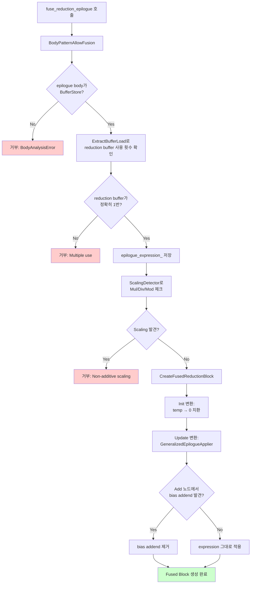

## 개요

기존의 `fuseReductionEpilogue` 구현은 명시적인 패턴 매칭에 의존하고 있었습니다. 즉, 각 에필로그 유형(Bias, BiasReLU, Clipping)에 대해 별도의 코드 경로가 필요했습니다. 이 방식은 기능적으로는 동작했지만 다음과 같은 한계가 있었습니다. 새로운 활성화 함수를 지원하려면 핵심 로직을 수정해야 하고, 새로운 패턴마다 명시적인 처리 코드가 필요했습니다.

명시적인 패턴 매칭 없이 임의의 에필로그 표현식을 처리할 수 있도록 `fuse_reduction_epilogue`를 일반화하였습니다.

## 패턴 매칭 방식

패턴 매칭 방식에서는 `EpilogueType` 열거형(enum)과 패턴 분석을 사용했습니다.

```cpp
enum class EpilogueType { Bias, BiasReLU, Clipping };

bool AnalyzeEpiloguePattern(const PrimExpr& value) {
  if (const auto* add = value.as<AddNode>()) {
    // Bias 패턴 확인: temp + C
    return EpilogueType::Bias;
  }
  if (const auto* max_node = value.as<MaxNode>()) {
    // BiasReLU 패턴 확인: max(temp + C, 0)
    return EpilogueType::BiasReLU;
  }
  // ... 더 많은 패턴 매칭
}
```

이로 인해 다음과 같은 코드가 만들어졌습니다.

```cpp
if (epilogue_type_ == EpilogueType::Bias) {
  // Bias 전용 처리
} else if (epilogue_type_ == EpilogueType::BiasReLU) {
  // BiasReLU 전용 처리
} else {
  // Clipping 전용 처리
}
```

## 표현식 기반 일반화

Epilogue Fusion은 다음과 같은 일관된 수학적 구조를 따릅니다.

`Init` 변환에서 Reduction Buffer Load를 항등원(덧셈의 경우 0)으로 교체합니다. `Update` 변환에서 Reduction Buffer Load를 Reduction Update Exprression으로 교체하는 동시에, Addend를 처리합니다.

원하는 flow는 다음과 같습니다.



### 0. 용어


### 1. 전체 표현식 저장

**변경 전:**

```cpp
EpilogueType epilogue_type_;
PrimExpr epilogue_addend_;  // Bias 전용
PrimExpr clipping_lower_;   // Clipping 전용
PrimExpr clipping_upper_;   // Clipping 전용
```

**변경 후:**

```cpp
PrimExpr epilogue_expression_;  // 전체 표현식: temp + C, max(temp + C, 0) 등
const BufferLoadNode* reduction_buffer_load_;  // 표현식 내의 temp[vi, vj] 로드

// 에필로그 표현식과 리덕션 버퍼 로드를 저장
epilogue_expression_ = inlined_store_->value;
reduction_buffer_load_ = loads[0];
```

### 2. Init 변환

 <br>
`Init` 블록은 `accumulator`가 항등원(덧셈의 경우 0)일 때의 에필로그 값을 계산해야 합니다. 이를 위해 Reduction Buffer Load를 0으로 교체합니다.

```cpp
class InitSubstituter : public ExprMutator {
  PrimExpr VisitExpr_(const BufferLoadNode* op) final {
    if (load->buffer.same_as(target_buffer_)) {
      return identity_elem_;  // temp → 0
    }
    return ExprMutator::VisitExpr_(op);
  }
};

InitSubstituter init_subst(inlined_buffer_, identity_elem);
PrimExpr init_epilogue = init_subst(epilogue_expression_);
// 단순화(Simplify): 0 + C[vi, vj] → C[vi, vj]
init_epilogue = analyzer.Simplify(init_epilogue);
```

### 3. Update 변환

Update 블록은 Reduction Buffer Load가 Reduction Update로 교체된 상태에서 iteration마다 에필로그 표현식을 적용해야 합니다. 이때 addend를 올바르게 처리해야 합니다.


위 과정을 수행하기 위해, 리덕션 버퍼 로드를 교체(`temp[vi, vj]` → `reduction_update`)합니다. (3. ->  4.) 그 후,Add 노드에서 addend를 감지하고 제거합니다. (2.에서 파란색 사각형 제거)

```cpp
class GeneralizedEpilogueApplier : public ExprMutator {
  // 1. Reduction Buffer Load를 Reduction Update로 교체
  PrimExpr VisitExpr_(const BufferLoadNode* op) final {
    if (load->buffer.same_as(target_buffer_)) {
      return replacement_;  // temp → reduction_update
    }
    return ExprMutator::VisitExpr_(op);
  }
  
  // 2. Add 노드에서 addend를 자동으로 감지하고 제거 
  PrimExpr VisitExpr_(const AddNode* op) final {
    PrimExpr a = VisitExpr(op->a);
    bool found_in_a = found_target_load_;
    found_target_load_ = false;
    
    PrimExpr b = VisitExpr(op->b);
    bool found_in_b = found_target_load_;
    
    if (found_in_a || found_in_b) {
      // 다른 피연산자가 리덕션 버퍼에서 온 것이 아닌지 확인
      // 그렇다면, 이는 제거해야 할 바이어스 가산수임
      bool other_is_reduction = /* 다른 피연산자가 Reduction Buffer인지 확인 */;
      if (!other_is_reduction) {
        // addend 제거
        return found_in_a ? a : b;
      }
    }
    return Add(a, b);
  }
};
```

### 4. 유효하지 않은 퓨전 방지

수학적으로 유효하지 않은 사례를 거부하기 위한 검증 로직을 추가했습니다.

#### 리덕션 결과 중복 사용 방지

리덕션 결과는 에필로그 표현식에서 정확히 한 번만 나타나야 합니다.

```cpp
if (loads.size() != 1) {
  return false;  // 거부: (temp + C) * (temp + D)는 유효하지 않음
}
```

리덕션 결과가 여러 번 나타나면, 각 발생 위치를 리덕션 업데이트로 교체할 때 잘못된 semantics이 생성됩니다. 예를 들어, `(temp + C) * (temp + D)`는 `(update + C) * (update + D)`가 되는데, 이는 `(final_sum + C) * (final_sum + D)`와 동일하지 않습니다.

#### Non-Additive Scaling 방지

곱셈, 나눗셈 또는 나머지 연산으로 리덕션 결과를 스케일링하는 에필로그를 거부합니다.

```cpp
class ScalingDetector : public ExprVisitor {
  void VisitExpr_(const MulNode* op) final {
    if (ContainsTarget(op->a) || ContainsTarget(op->b)) {
      has_scaling_ = true;  // 거부: (temp * 2) + C
    }
  }
  // DivNode 및 ModNode에 대해서도 유사함
};
```

---

**시리즈 포스트**

- 이전: [FuseReductionEpilogue: Clipping 패턴 지원 구현](/posts/2026/01/tvm-fuse-reduction-epilogue-clipping/)

**Language**: [English](/posts/2026/01/tvm-fuse-reduction-epilogue-generalization-en/)

